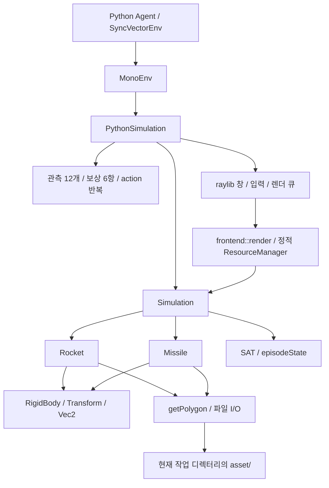
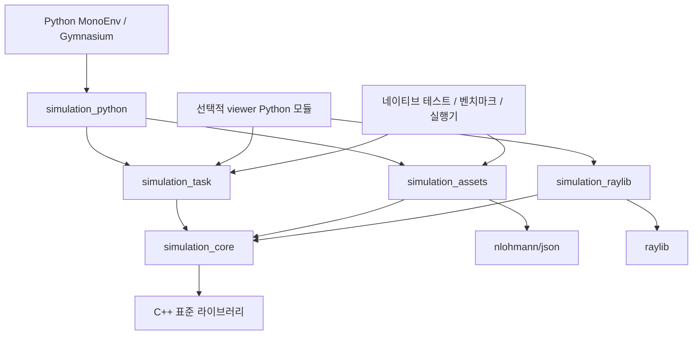
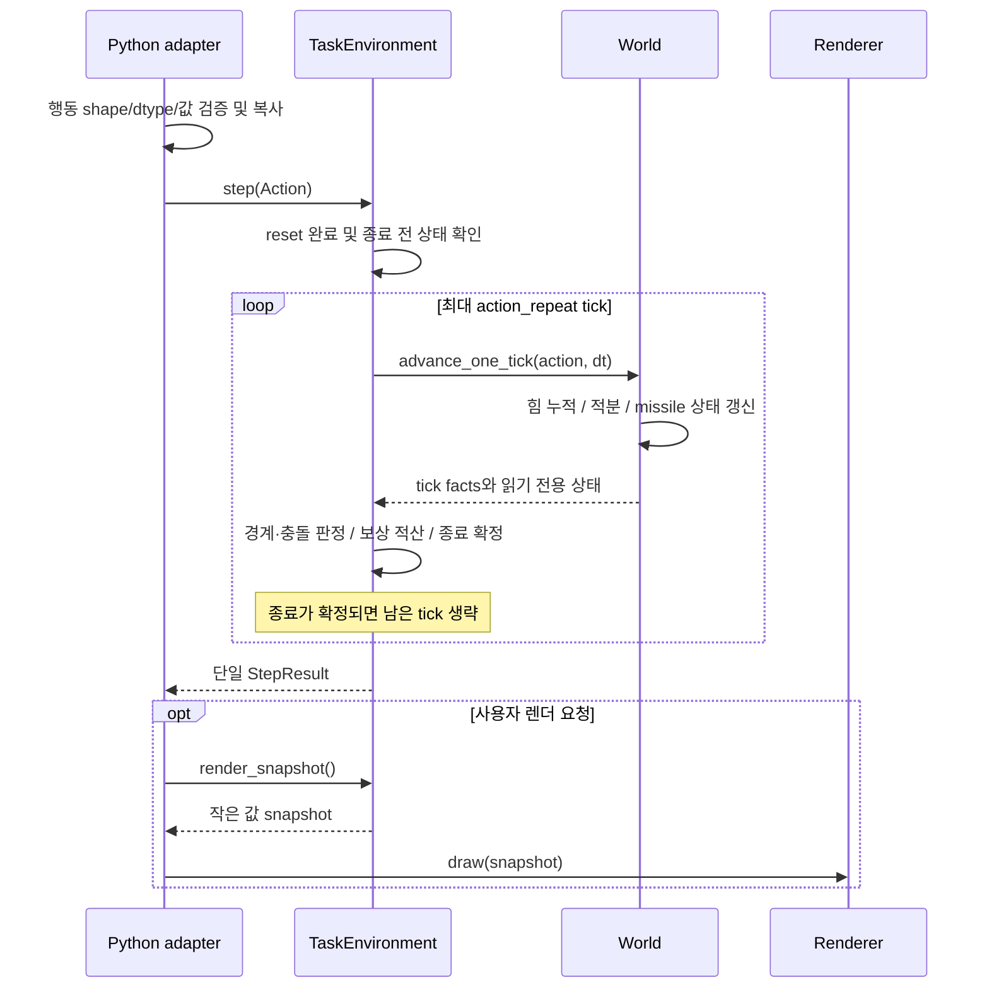

# C++ 로켓 시뮬레이션 설계 분석 및 최종 아키텍처 제안

작성일: 2026-09-14  
분석 기준: HEAD `93e5312`와 **분석 시점의 미커밋 변경을 포함한 작업 트리**  
범위: `simulation/` 전체, 루트 CMake·패키징 설정, Python 환경 및 학습 실행부의 연결 지점

## 1. 결론

현재 시스템에는 고정 시간 간격의 물리 업데이트, 작은 값 타입, 로켓과 미사일의 분리, 렌더링 없는 실행 경로라는 좋은 출발점이 있다. 그러나 **독립적인 시뮬레이션 라이브러리의 경계가 빌드와 API에 구현되어 있지 않다.** Python 래퍼가 실행 제어, 관측 인코딩, 보상 계산, 창 관리, 프레임 보관을 모두 맡고, 엔티티 생성자는 파일을 직접 읽는다. 이 결합 때문에 학습 규칙을 바꾸거나 렌더러를 교체하거나 서버에서 배포할 때 서로 무관한 부분까지 영향을 받는다.

가장 먼저 해결할 문제는 추상화의 부족보다 **상태와 API 계약의 불일치**다. 같은 seed로 reset해도 미사일의 이전 위치·속도가 관측에 남고, 관측 범위 선언을 위반할 수 있으며, 행동 배열의 stride를 무시한다. 이 문제를 그대로 둔 채 파일만 나누면 설계상 결함도 새 구조로 이동한다.

최종안은 **동일 프로세스 안의 모듈형 C++ 라이브러리 구조**다.

- `simulation_core`: 물리 상태, 미사일 생명주기, 고정 tick 전이, 충돌 기하.
- `simulation_task`: 에피소드 종료 정책, 행동 반복, 관측·보상 규칙과 버전.
- `simulation_assets`: 파일에서 검증된 불변 형상 데이터를 만드는 로더.
- `simulation_python`: 입력 검증과 Python/C++ 데이터 변환.
- `simulation_raylib`: 화면·입력·GPU 자원의 수명 및 읽기 전용 장면 렌더링.
- Python `MonoEnv`: Gymnasium 인터페이스와 학습 도구 연결.

이 규모에서 ECS, 메시지 버스, 서비스 분리, 범용 게임 엔진을 먼저 도입할 필요는 없다. 현행 로켓 1개·미사일 1개의 구체적인 모델을 유지하면서 책임과 소유권을 명확히 하는 편이 변경 비용이 작다. 물리 모델의 사실성을 높이는 작업은 별도 요구사항으로 취급한다.

## 2. 분석 방법과 검증 범위

### 2.1 조사한 코드

| 구역 | 주요 근거 |
|---|---|
| 월드와 에피소드 | [`simulation.hpp`](../simulation/include/entity/simulation.hpp), 특히 24–65, 67–92행 |
| Python 바인딩·학습 규칙·창 제어 | [`simulation.cpp`](../simulation/source/simulation.cpp), 32–219행 |
| 엔티티 | [`rocket.hpp`](../simulation/include/entity/rocket.hpp), [`missile.hpp`](../simulation/include/entity/missile.hpp), [`missile.cpp`](../simulation/source/entity/missile.cpp) |
| 물리·기하 | [`rigidbody.hpp`](../simulation/include/physics/rigidbody.hpp), [`transform.hpp`](../simulation/include/physics/transform.hpp), [`vec2.hpp`](../simulation/include/physics/vec2.hpp), [`collide.cpp`](../simulation/source/physics/collide.cpp), [`constants.hpp`](../simulation/include/physics/constants.hpp) |
| 렌더링·에셋 | [`renderer.hpp`](../simulation/include/frontend/renderer.hpp), [`controller.hpp`](../simulation/include/frontend/controller.hpp), [`json.cpp`](../simulation/source/utils/json.cpp), [`rocket 형상`](../asset/rocket/polygon.json), [`missile 형상`](../asset/missile/polygon.json) |
| 빌드·배포 | [`CMakeLists.txt`](../CMakeLists.txt), [`pyproject.toml`](../pyproject.toml) |
| Python 소비자 | [`mono_env.py`](../learning/environment/mono_env.py), [`typing.py`](../learning/environment/typing.py), [`simulation.pyi`](../learning/simulation/simulation.pyi), [`config_model.py`](../learning/agent/config_model.py), [`ppo.py`](../learning/agent/ppo.py), [`test.py`](../learning/scripts/test.py) |

행 번호는 분석 시점 기준이다. 기존 미커밋 변경과 삭제된 문서는 분석 전에 이미 존재했으며 복구하거나 수정하지 않았다. 이번 작업의 저장소 산출물은 이 문서뿐이다.

### 2.2 실제 수행한 검증

현재 소스를 직접 사용하는 일회성 C++ 검증 프로그램을 OS 임시 디렉터리에서 작성·컴파일했다. GCC 15.2.0, C++23, 기존 캐시의 nlohmann/json 헤더를 사용했고, `missile.cpp`, `collide.cpp`, `json.cpp`를 연결했다. 저장소의 CMake 빌드나 `.pyd`를 갱신하지 않았다. 최초 정적 링크는 로컬 MinGW 런타임의 미해결 심볼로 실패했고, 동적 런타임 링크로 다시 컴파일한 프로그램은 정상 실행됐다. 이를 프로젝트의 빌드 결함으로 분류하지 않는다.

| 검증 | 결과 | 해석 |
|---|---|---|
| `Simulation(100000) → reset(42) → 700회 update → reset(42)` | 미사일 중심이 최초 `(30, 30)`에서 reset 후 `(780.615051, 313.769867)`로 달라짐. 속도도 `(-60.1966095, -3.38093495)`가 남고 `alive=false` | 동일 seed reset이 전체 관측 상태를 복원하지 않음. 700회 직접 update는 이전 상태를 만드는 검증용이며 일반 Gym 에피소드 실행을 모사한 것은 아님 |
| `Simulation(1)`을 두 번 update | 첫 tick의 Timeout 이후 두 번째 tick에도 로켓 위치 변경 | 종료 이후 update를 막는 계약이 코어에 없음 |
| 미사일 지연만 0으로 둔 spawn 검증, 로켓 중심 x=900 | 상대 x 관측식의 결과 `-1.03125` | 기본 spawn 위치 규칙 자체가 선언된 관측 범위를 넘을 수 있음. 실제 학습 중 발생 빈도는 측정하지 않음 |
| 경계만 맞닿은 두 사각형 SAT | `false` | 접촉을 충돌로 취급하지 않는 현행 정책 확인 |
| 두 JSON 형상의 연속 변 외적 검사 | 로켓 13점·미사일 10점 모두 외적 양수 | 현행 형상에서 오목성의 증거는 발견하지 않음. 일반 입력에 대한 유효성 검증을 대체하지 않음 |
| raylib `DrawTexturePro` 구현 대조 | 회전 0일 때 화면 좌상단은 `dest - origin` | 현재 좌표 전달 방식의 반 크기 오프셋 확인 |

Python 바인딩의 위험은 현재 C++ 선언 및 pybind11 계약을 대조한 정적 분석이다. 기존 `.pyd`는 현재 작업 트리와 동일한 소스로 빌드됐다는 보장이 없어 검증 근거로 사용하지 않았다. GUI 재시작, 실제 휠 설치, 학습 성능·수렴, 다중 스레드 동작은 실행 검증하지 않았다. 아래에서는 **확인된 동작**, **조건부 위험**, **제안하는 정책 변경**을 구별한다.

## 3. 현재 아키텍처와 실행 흐름



생성 시 `Simulation`이 하드코딩된 월드·엔티티를 구성하고, 엔티티 생성자가 충돌 형상 JSON을 읽는다. `Simulation` 생성자는 즉시 reset한다. `PythonSimulation`은 선택적으로 창을 연다. `MonoEnv.reset(seed)`는 Python RNG에서 C++용 seed를 뽑아 넘긴다.

행동 한 번의 실제 흐름은 다음과 같다.

1. NumPy 입력을 정수 포인터로 읽어 `(left, main, right)` bool tuple로 바꾼다.
2. 최대 `actionPeriod`회 반복한다. 각 반복에서 tick 증가, 로켓 중력·추력 적용, 속도·위치 적분, 미사일 이동 또는 spawn을 수행한다.
3. 렌더링 인스턴스라면 `Simulation` 전체와 행동을 큐에 복사한다.
4. 매 tick 종료 상태를 조회하고 종료이면 반복을 끝낸다.
5. Python이 종료 상태·관측·보상을 별도 호출로 가져온다. 보상은 마지막 상태에서 한 번 계산한다.
6. `render()`가 큐의 프레임을 순차 소비하며 120 FPS 목표로 출력한다.

현재 `dt=1/120`이므로 기본 `action_period=2`는 정상 진행 시 행동 1회당 약 1/60초다. `timeout`은 **물리 tick 수**이며 Python step 수가 아니다. `config.yaml`의 21600은 기본 dt에서 180초에 해당한다. 실제 정책 step 수는 조기 종료가 없을 때 `ceil(timeout / action_period)`다. 그런데 `EnvConfig.timeout_step`은 내림 나눗셈을 사용한다(`config_model.py` 44–47행).

현재 미사일은 spawn 때 로켓 위치에 오차를 더해 방향을 한 번 정한 뒤 등속으로 이동한다. 매 tick 유도 방향을 갱신하는 추적 미사일이 아니다. 또한 연료 소비·질량 변화·공기 저항·충돌 반발은 구현되어 있지 않다. 회피 학습용 모델로는 가능한 선택이며, 요구사항 없이 그 자체를 결함으로 판단하지 않는다.

## 4. 문제점과 해결 방향

우선순위는 P0=계약·정확성 우선, P1=모듈 경계·수명·배포, P2=측정 후 성능·확장으로 나눈다. P0라고 해서 모든 문제가 보안 취약점이거나 현행 학습 경로에서 항상 발생한다는 뜻은 아니다.

### 4.1 P0 — reset과 난수 계약이 일치하지 않는다

**근거:** `Simulation::reset` 54–57행, `Rocket::reset` 64–88행, `Missile::reset` 89–97행, `getObs` 83–88행.

로켓은 transform과 rigid body를 초기화하지만, 미사일 reset은 RNG 재시딩·`alive=false`·지연 재추첨만 수행한다. 미사일 transform과 속도는 이전 에피소드 값이다. 관측 인코더는 미사일이 비활성이어도 그 위치·속도를 읽으므로 **이전 에피소드가 새 에피소드의 초기 관측에 섞인다.** 명시 seed를 반복해도 초기 관측이 같지 않을 수 있다.

또한 `seed=None`의 의미가 분열되어 있다. 로켓은 초기 상태를 무작위화하지 않고, 미사일은 현재 RNG 스트림을 이어간다. Python의 `randomize_initial_state=False`도 미사일 난수성을 제거하지 않는다. 미사일 RNG가 인스턴스 멤버라는 점은 장점이며, 전역 RNG로 인스턴스가 간섭하는 구조는 아니다.

**해결:** 에피소드 reset과 미사일 despawn을 다른 함수로 분리한다. reset은 transform·속도·힘·각속도·활성 상태·timer·종료 상태를 모두 초기화한다. 비활성 미사일의 관측 feature는 명시된 중립값으로 마스킹한다. 무작위화 여부는 config, 재현성은 seed로 분리한다. `seed=None`은 이미 가진 RNG 스트림을 이어가는 의미로 통일한다. 새 인스턴스의 seed 결정과 그 기록도 명시한다.

Gymnasium에서도 seed 생략 시 기존 RNG를 재초기화하지 않는 계약을 설명한다. Python과 C++의 seed를 동일 숫자라고 가정하지 말고 변환 규칙과 실제 C++ seed를 기록해야 한다. [Gymnasium Env](https://gymnasium.farama.org/api/env/)

### 4.2 P0 — Python 행동 입력 검증이 메모리 배치를 고려하지 않는다

**근거:** `PythonSimulation::step` 138–147행, `typing.py` 9–10행, `simulation.pyi` 26행.

`assert(action.shape(0) == 3)`만 검사한 후 `action.data()[0..2]`를 읽는다. 이것은 다음을 보장하지 않는다.

- 정확히 1차원 `(3,)`인지: `(3,1)` 등도 첫 축 검사만 통과한다.
- 메모리가 연속적인지: `np.array([1,0,0,0,1,0], dtype=np.int32)[::2]`의 논리 행동은 `[1,0,1]`이지만 현재 포인터 읽기는 `[1,0,0]`을 읽을 수 있다.
- 원소가 0 또는 1인지: 음수·2도 bool로 변환되어 참이 된다.
- Release에서 길이가 검증되는지: `assert`가 제거되면 짧은 배열에서 범위를 넘는 읽기가 가능하다. 반전 view의 음수 stride도 특히 위험하다.

`py::array_t<int>`의 기본 변환 옵션은 C 연속 메모리를 강제하지 않는다. dtype 변환이 우연히 복사를 일으키는 입력에서는 문제가 가려질 수 있다. [pybind11 NumPy](https://pybind11.readthedocs.io/en/stable/advanced/pycpp/numpy.html)

**해결:** 바인딩에서 차원·shape·dtype·값을 예외로 검증하고, stride를 존중하여 읽거나 검증 후 연속 배열로 정규화한다. float를 int로 바꾼 뒤 검증하면 `0.5` 같은 잘못된 입력이 숨겨지므로, 새 계약에서는 bool 및 정수 0/1만 받고 float 입력은 거부한다. 최종적으로 작은 `Action { bool left, main, right; }` 값으로 복사한다. 코어는 NumPy를 알지 않는다. Python의 `ActType`도 현재 float32 표기에서 실제 계약에 맞게 정리한다. 기존 호출부의 정수 배열과 `MultiBinary` 정수 dtype은 지원한다.

### 4.3 P0 — 관측 스키마, 범위, 상태 충분성이 명확하지 않다

**근거:** `getObs` 65–90행, `MonoEnv` 24행, `typing.py` 6행, 미사일 spawn 74–85행.

`Box(-1,1,shape=(12,))`와 실제 관측식은 일치하지 않는다. 미사일은 화면 밖에서 생성되고 추가 여유 영역까지 이동한다. 로켓과의 상대 x는 ±1을 넘을 수 있다. 로켓도 종료 직전 tick에는 공간 밖까지 이동할 수 있어 terminal observation까지 포함한 범위를 검토해야 한다.

관측 길이와 순서는 C++, Python 타입, 디버그 UI에 각각 하드코딩되어 있다. 로켓 위치는 좌하단 `pos`, 미사일 상대 위치와 보상은 중심을 사용한다. 이 혼용이 모든 상황에서 수치 오류를 만들지는 않지만, feature의 의미와 좌표 기준을 이해하기 어렵게 한다.

미사일 respawn 대기시간과 잔여 시간은 관측되지 않는다. 따라서 feed-forward 정책 입장에서 미래 spawn 시점을 현재 관측만으로 정확히 구별할 수 없는 부분 관측 환경이다. 이것은 모델 선택의 문제이며, 관측에 모든 내부 PRNG 상태를 노출해야 한다는 뜻은 아니다.

**해결:** 이름·순서·dtype·단위·범위·비활성 마스크·정규화 scale을 가진 `ObservationSpec`을 하나의 계약으로 제공한다. Python 공간은 여기서 만든다. 기존 12개 feature를 유지하는 `obs_v1`과, 중심 좌표·비활성 마스크·필요한 timer feature를 정리하는 `obs_v2`를 구분한다. timer를 숨기기로 한다면 부분 관측 과제임을 명시하고 필요 시 이력 또는 recurrent policy를 검토한다.

범위 해결은 무조건적인 clipping보다 feature별 선택이 우선이다. v1은 기존 수치를 보존하면서 공간의 실제 범위를 선언하고, v2는 검증된 공간 한계에 따른 scale이나 `tanh`를 사용한다. clipping을 택하면 손실되는 위치 정보까지 과제 버전 변경으로 기록한다. 일반 observation과 terminal observation 모두 선언한 공간에 포함되어야 한다. [Gymnasium Env](https://gymnasium.farama.org/api/env/)

### 4.4 P0 — 종료 상태가 확정된 전이 결과가 아니라 매번 재계산된다

**근거:** `Simulation::update/episodeState` 60–92행, `PythonSimulation::step` 150–162행, `getReward` 117–135행, `MonoEnv.step` 30–40행.

`episodeState()`는 경계·SAT·timeout을 호출할 때마다 재판정한다. 정상 Python step에서도 반복 내부 판정, Python의 상태 조회, 보상 계산에서 같은 상태를 다시 검사할 수 있다. 종료 상태를 저장하지 않고 update 진입에서도 확인하지 않아 종료 후 호출이 상태를 바꾼다. Timeout은 tick 때문에 유지되지만, 충돌·경계 이탈 같은 상태는 후속 이동에 따라 다른 결과로 바뀔 수 있다.

동시 발생 시 순서는 `OutOfBound → MissileCollision → Timeout`이며 코드 순서가 정책을 결정한다. 현재 Python은 충돌·경계 이탈을 terminated, 시간 제한을 truncated로 구분하고 있어 이 구분은 유지할 가치가 있다.

**해결:** `TaskEnvironment::step()`이 substep마다 사건을 계산한 뒤 종료 원인·관측·보상·실제 진행 tick 수를 하나의 `StepResult`로 확정한다. 상태 조회는 확정된 결과를 읽기만 한다. 종료 후 추가 step은 상태 변경 없이 예외를 낸다. 경계·충돌 동시 발생 우선순위와 timeout 동시 처리도 정책으로 명시한다. 최종안의 기본값은 실패 사건 우선, 실패가 없을 때 외부 시간 제한을 truncation으로 적용하는 것이다.

### 4.5 P0 — 물리 시간, 보상 적산, 행동 주기가 암묵적으로 연결된다

**근거:** `constants.hpp` 9–11행, `PythonSimulation` 97–163행, `EnvConfig` 39–47행.

현재 보상은 물리 tick마다 더하지 않고 행동 반복이 끝난 마지막 상태에서 한 번 계산한다. `action_period`가 2에서 4로 바뀌면 같은 시뮬레이션 시간 동안 받는 생존 보상 횟수와 할인 적용 횟수가 달라진다. 조기 종료로 실제 진행 시간이 짧아져도 그 길이는 Python에 반환하지 않는다. 마지막 상태 보상은 가능한 과제 정의지만, 행동 주기를 단순 성능 옵션처럼 바꾸면 학습 목적도 변한다.

`get_reward_list()`는 6개 원시 shaping 항이고 `get_reward()`는 그 합을 10으로 나누거나 종료 페널티로 교체한다. 디버그 항들의 합이 실제 보상과 같지 않아 로그 해석도 어렵다.

**해결:** `physics_dt_seconds`, `action_repeat`, `max_physics_ticks`, `advanced_ticks`, `elapsed_seconds`로 의미를 드러낸다. 기존 `reward_v1`은 마지막 상태 평가·스케일·페널티를 유지한다. 새 `reward_v2`는 다음처럼 시간 기반으로 정의할 것을 권한다.

```text
reward = sum(reward_rate(state_i, action) * physics_dt_seconds)
         + terminal_event_reward
```

종료 tick에서 shaping도 포함할지, terminal penalty로 대체할지는 v2 정책에 하나로 고정한다. 권장 기본은 진행한 각 tick의 rate를 적산하고 terminal event를 한 번 더하는 방식이다. 바뀐 보상 scale은 별도 보정하고 기존 학습과 섞어 비교하지 않는다. `RewardBreakdown`은 스케일 적용과 종료항을 포함하여 실제 `reward`와 합이 같게 만든다. 할인율도 물리 시간에 맞추려면 학습 측에서 `gamma(dt)=exp(-lambda*dt)`처럼 정의하되 v1의 gamma를 조용히 변경하지 않는다.

### 4.6 P1 — 바인딩이 시뮬레이션 애플리케이션 전체를 소유한다

**근거:** `PythonSimulation` 32–193행, `CMakeLists.txt` 55–65행.

관측이나 보상식을 바꾸려면 pybind11과 raylib가 들어 있는 번역 단위를 수정·빌드한다. Python 객체 없이 동일 과제를 실행하는 네이티브 테스트·벤치마크를 만들기 어렵고, 렌더러는 `Simulation` 구체 클래스 전체에 의존한다. 다만 기존 `Simulation` 자체가 Python API를 직접 호출하지 않는다는 점은 분리 시 활용할 수 있다.

**해결:** 과제 정책과 step orchestration을 Python에 의존하지 않는 `simulation_task`로 이동한다. 바인딩은 값 변환만 담당한다. 기본 관측·보상은 C++에 두어 substep 적산·재사용·배치 실행이 가능하게 하고, 실험용 외부 보상 shaping은 Python wrapper에서 선택적으로 더한다. 코어에서 Python callback을 매 tick 부르는 구조는 피한다.

### 4.7 P1 — 형상 데이터와 동적 상태가 섞이고 생성자에서 파일을 읽는다

**근거:** `Rocket` 생성자 32–35행, `Missile` 생성자 27–30행, `json.cpp` 12–25행, 렌더 큐 38·158·178행.

현재 프로세스의 작업 디렉터리가 프로젝트 루트여야 JSON을 찾는다. 환경을 여러 개 만들면 동일 형상을 반복해서 읽고 보관한다. 렌더 큐는 매 tick transform뿐 아니라 형상 vector와 미사일 RNG까지 포함한 `Simulation`을 복사하며, `render()`의 구조 분해에서도 다시 복사한다. 큐 길이는 `actionPeriod`로 제한되므로 무한 증가 문제는 아니다.

로더는 파일 열기, 필수 필드, 최소 정점 수, 유한 수치, 원본 크기 0, 퇴화·자기 교차·볼록성을 명시적으로 검증하지 않는다. JSON 파싱·타입 오류 일부는 라이브러리 예외가 나지만 도메인 경로와 원인을 설명하는 오류 계약이 없다. 누락된 `vertices`는 빈 형상으로 이어질 수 있고 빈 형상은 충돌 없음으로 처리된다.

**해결:** 외부 조립 지점에서 `AssetLoader`가 검증된 `ShapeLibrary`를 한 번 만든다. 코어에는 준비된 형상 또는 형상 ID를 주입한다. 불변 형상은 값 또는 `shared_ptr<const ShapeLibrary>`로 공유하고, 바뀌는 위치·속도·timer·RNG는 환경별로 소유한다. 렌더링에는 작은 `RenderSnapshot`만 보낸다. snapshot은 형상/스프라이트 ID와 필요한 pose만 담고, 저장 대상 리소스의 수명은 renderer 또는 asset bundle이 보장한다.

### 4.8 P1 — 창 수명과 GPU 자원 수명이 분리되어 있다

**근거:** `PythonSimulation` 51–62·184–188행, `ResourceManager` 16–44행.

창은 인스턴스 `close()`가 닫지만 텍스처는 함수 정적 객체가 보관하다 프로세스 종료 시 해제한다. 첫 창을 닫아도 manager는 남아, 같은 프로세스에서 다음 창을 열면 기존 컨텍스트의 텍스처 핸들을 재사용할 위험이 있다. 텍스처 소멸자가 컨텍스트 종료 후 실행되는 순서도 잘못되기 쉽다. `PythonSimulation`에는 창을 정리하는 명시적인 소멸자가 없어 사용자가 `close()`를 빠뜨리는 경로도 처리하지 못한다. 실제 GUI 오류 발생은 실행 검증하지 않았다.

**해결:** `RaylibRenderer`가 창과 텍스처를 하나의 수명 범위로 소유하게 한다. 텍스처 해제 후 창 종료 순서를 보장하고, 복사를 금지하며, `close()`는 여러 번 호출해도 안전하게 만든다. Python context manager로 명시적인 정리를 지원한다. GUI 생성·사용·종료는 소유 스레드에서 처리하고, 임의의 Python finalizer 스레드가 GPU 해제를 수행하도록 의존하지 않는다. 프로세스당 창 1개 제약은 renderer factory에서 명시하되 headless 환경 개수와 연결하지 않는다. raylib 공식 예제도 텍스처를 먼저 해제하고 창을 닫는다. [raylib texture 예제](https://www.raylib.com/examples/textures/loader.html?name=textures_tiled_drawing)

### 4.9 P1 — 화면과 충돌의 기준점이 일치하지 않는다

**근거:** `Transform` 12–41행, `calculatePolygon` 23–27행, `renderer.hpp` 65–80행.

물리는 좌하단 `pos`를 가지고 충돌 형상을 중심 주위로 회전한다. 렌더러는 화면 좌상단 좌표를 `dest.x/y`에 전달하면서 `origin`은 크기의 절반으로 지정한다. raylib가 destination에서 origin을 빼므로 그림의 중심이 원래 의도한 좌상단에 놓인다. 회전 0, 배율 1, 크기 60×60이면 의도한 위치보다 화면의 왼쪽·위로 각각 30씩 이동한다. 원래 화면 좌상단이 `(450,240)`이면 실제 좌상단은 `(420,210)`이 된다. 회전 시에도 기준점 불일치가 지속된다. [raylib 6.0 DrawTexturePro 구현](https://github.com/raysan5/raylib/blob/6.0/src/rtextures.c)

또한 경계 판정은 회전하지 않은 사각형을 사용하고 충돌은 회전한 다각형을 사용한다. 부분 이탈을 허용하고 완전히 나간 경우에 종료하는 현재 규칙이 의도인지 명세가 없다. 폭만으로 화면 배율을 결정하고 16:9를 assert로 요구해 다른 창 크기를 안정적으로 다루지 못한다.

**해결:** 월드 pose를 중심 좌표·라디안·반시계 회전으로 정리한다. `angle=0`은 로컬 +X축이 월드 +X축을 향하며 로켓 추력은 로컬 +Y축으로 정의한다. 충돌 형상은 중심 기준 local 좌표를 사용한다. renderer는 중심을 화면 좌표로 바꿔 `dest`에 전달하고 반 크기 `origin`을 사용한다. `WorldToScreen` 한 곳에서 y 반전, 배율, letterbox offset을 처리한다. 경계 규칙은 `legacy_unrotated_fully_outside`와 회전 형상 기준 규칙을 구별하여 과제 버전에 포함한다.

### 4.10 P1 — 충돌·물리의 입력 조건과 수치 정책이 암묵적이다

**근거:** `collide.cpp` 35–85행, `RigidBody` 16–19·41–50행, `Transform::rotate` 48행, `constants.hpp`.

SAT는 매 호출에서 두 world polygon과 모든 edge vector를 할당하고 변환한다. 접촉은 `<=` 때문에 비충돌이며 epsilon 정책은 없다. 현재 에셋에서 오목성 문제는 발견하지 않았지만 입력 형상의 볼록성·퇴화를 보장하는 경계가 없다. 이산 tick 위치만 검사하므로 충분히 빠르거나 얇은 형상에서는 충돌을 통과할 가능성이 있다. **현재 설정에서 tunneling이 실제 발생했다고 확인한 것은 아니다.**

질량·관성모멘트·dt의 양수와 유한성 검사가 없고 `mass`, `moi`는 public mutable이다. 좌표는 meter 주석이 있으나 화면 크기와 동일한 960×540, 엔티티 크기 60 등을 사용한다. SI 모델인지 학습용 world unit인지 계약을 정해야 한다. 로켓의 적분 순서는 갱신한 속도로 위치를 이동하는 semi-implicit Euler이며, 단순하다는 이유만으로 교체할 필요는 없다.

**해결:** 설정 생성 시 유효성을 검증하고 실행 중 불변으로 둔다. 동일 pose 변환을 충돌과 디버그 표시에서 공유한다. 초기 구현은 현재 SAT를 유지하되 asset 검증, 접촉·epsilon 규약, 할당 재사용부터 적용한다. 정규화하지 않은 SAT 축을 유지한다면 epsilon을 축 길이에 맞춰 스케일하거나 축을 정규화해야 한다. 속도·최소 형상 두께·dt의 위험도를 측정한 뒤 필요할 때만 substep 또는 swept/TOI 판정을 도입한다. Box2D 문서의 볼록 형상 및 TOI 개념은 검토 기준이며 라이브러리 교체를 필수로 제안하는 것은 아니다. [Box2D Collision](https://box2d.org/documentation/md_collision.html)

### 4.11 P1 — headless 빌드와 배포가 실제로 분리되어 있지 않다

**근거:** `CMakeLists.txt` 18–43·45–83행, `pyproject.toml` 41–50행.

렌더링을 사용하지 않는 Python 인스턴스도 동일 확장 모듈을 사용하며 빌드에서 raylib를 항상 가져와 연결한다. headless 실행 경로는 있지만 headless 전용 빌드 경로는 없다. 전역 include directory는 모듈 간 의존성을 숨긴다.

확장 suffix를 `.pyd`로 고정해 플랫폼별 기본 확장 모듈 이름 규칙을 덮어쓴다. 빌드 결과를 소스 디렉터리에 복사하므로 설치본·빌드본·오래된 소스 옆 바이너리가 섞일 수 있다. wheel 패키지는 `learning`으로 지정되어 있지만 루트 `asset/`을 설치하는 규칙은 보이지 않는다. 다른 작업 디렉터리나 설치 환경에서 에셋을 찾지 못할 위험이 있다. 실제 wheel 설치 실패까지 확인한 것은 아니다.

**해결:** 코어, 과제, 로더, Python, renderer를 CMake target으로 분리하고 target별 include/link 의존성을 선언한다. `ROCKETFORGE_BUILD_PYTHON`, `ROCKETFORGE_BUILD_RENDERER`, `BUILD_TESTING` 옵션으로 불필요한 의존성의 FetchContent 자체를 생략한다. pybind11의 플랫폼별 suffix를 유지하고 post-build 소스 복사를 없애며 빌드·설치 결과를 기준으로 개발한다. 에셋을 패키지 리소스로 설치하고 작업 디렉터리와 무관한 root를 주입한다. [CMake target_link_libraries](https://cmake.org/cmake/help/latest/command/target_link_libraries.html)

의존성은 현재도 tag/version이 고정된 부분이 있으므로 모두 무버전이라고 평가하면 안 된다. 추가로 배포 아카이브 hash와 빌드 메타데이터를 기록하고, 이미 설치된 pybind11을 쓸지 FetchContent 버전을 쓸지 일관된 정책을 정한다.

### 4.12 P2 — 병렬 실행·성능 검증의 기반이 부족하다

**근거:** `ppo.py` 136–145행, `PythonSimulation::step/getObs`, `CMakeLists.txt` 전체, `test.py` 106–124행.

현재 학습부는 `SyncVectorEnv`를 사용하므로 여러 환경을 순차 실행한다. C++ step에는 GIL release가 없고 매 observation마다 NumPy 배열을 할당한다. 이것들은 최적화 후보지만 병목 비율은 측정하지 않았다. process 기반 병렬화는 GIL의 직접 제약을 받지 않지만 IPC 비용이 생긴다.

시뮬레이션 단위의 자동 회귀 테스트 target은 발견하지 못했다. `learning/scripts/test.py`에는 수동 실행·학습 및 `check_env` 경로가 있으므로 테스트가 전혀 없다고 표현하는 것은 부정확하다. 다만 reset 반복성·stride·종료 후 step·창 재시작 같은 계약을 지속 검증하는 구조는 없다.

**해결:** 먼저 headless 코어의 ticks/sec, 환경 step latency, 충돌 비용·할당 수, Python 변환 비용을 측정한다. 필요한 경우 `BatchEnvironment`와 `(N,3) → (N,D)` 배치 API를 추가하고, Python 입력을 C++ 값으로 확보한 뒤 순수 계산 구간만 GIL을 해제한다. 반환용 Python 객체 생성은 GIL 재획득 후 수행한다. 단일 인스턴스 동시 접근은 금지하고, 배치 worker는 서로 다른 월드만 갱신하도록 한다. GIL 해제만으로 현재 `SyncVectorEnv`가 자동 병렬화되는 것은 아니다. [pybind11 GIL](https://pybind11.readthedocs.io/en/stable/advanced/misc.html#global-interpreter-lock-gil)

## 5. 최종 제안 아키텍처

### 5.1 모듈 의존성

아래 화살표는 소스·빌드 의존 방향이다. 조립 지점은 여러 모듈을 알 수 있지만 코어는 외부 어댑터를 알지 않는다.



headless Python 확장에는 viewer 연결을 넣지 않는다. 렌더링이 필요한 Python 사용자에게는 선택적인 별도 viewer 확장/어댑터를 제공한다. 당장 배포 파일을 두 개로 나누기 어렵다면 renderer OFF 빌드부터 지원하되, 최종적으로 headless wheel이 raylib를 요구하지 않는 것을 수용 기준으로 삼는다.

### 5.2 책임과 소유권

| 구성 요소 | 소유하는 것 | 제공하는 계약 | 의존하면 안 되는 것 |
|---|---|---|---|
| `World` | 로켓·미사일 동적 상태, 미사일 timer, 환경별 RNG, 물리 tick | `reset`, `advance_one_tick`, 읽기 전용 snapshot | Python, GPU, 파일 경로, 학습 보상 |
| `ShapeLibrary` / body definition | 검증된 불변 local 형상, 질량·관성·엔진 정의 | shape ID와 읽기 전용 형상 | 월드 가변 상태, GPU 핸들 |
| physics/geometry 함수 | 필요한 경우 환경별 scratch buffer | 적분, local→world, SAT 결과 | 에피소드 보상·종료 정책 |
| `TaskEnvironment` | `World`, 과제 config, 마지막 `StepResult`, 종료 latch | 행동 반복, 종료 판정, observation/reward 계산 | pybind11, raylib, 디스크 I/O |
| `ObservationEncoder` / `RewardModel` | 버전·scale·weights 등 작은 불변 설정 | 지정된 schema와 보상 breakdown | 렌더러, 학습 optimizer |
| `AssetLoader` | 로딩 중 임시 데이터 | 파일→검증된 `ShapeLibrary` | 월드 업데이트, 창 |
| Python adapter | C++ task 인스턴스와 변환 버퍼 | 검증된 Python API | 독자적인 물리·보상 규칙 |
| `RaylibRenderer` | 창, GPU 텍스처, 카메라, 최근 snapshot | `draw`, 입력 poll, `close` | 월드 변경 권한, RNG |
| `MonoEnv` | task 및 선택적 viewer adapter | Gym step/reset/spaces/metadata | C++ 내부 메모리 배치 |

`World`는 unique ownership으로 두고, 동일 환경을 두 실행 주체가 갱신하지 못하게 한다. 불변 에셋만 공유한다. 월드 복사는 기본적으로 금지하거나 명시적 checkpoint API로 제한한다. 작은 encoder와 reward policy는 먼저 구체 타입과 config로 구현하고, 실제 교체 요구가 있을 때만 interface/variant를 도입한다.

### 5.3 권장 디렉터리

```text
simulation/
  include/rocketforge/
    core/          # Action, Pose, WorldState, World, Shape, snapshot
    task/          # TaskEnvironment, StepResult, ObservationSpec, RewardSpec
  src/
    core/          # entities, integration, geometry, RNG/reset
    task/          # action repeat, episode rules, encoders, reward models
    assets/        # JSON loader, validation
    bindings/      # Python module, array validation, exception mapping
    frontend/      # raylib renderer, input, coordinate mapping
  tests/
    core/
    task/
    bindings/
  benchmarks/
learning/
  environment/     # Gymnasium adapter와 학습용 wrappers
  simulation/      # 확장 패키지 인터페이스·stub·패키지 리소스
```

target은 `rocketforge_core`, `rocketforge_task`, `rocketforge_assets`, Python `simulation`, 선택적 `rocketforge_raylib`로 구성한다. namespace와 include prefix를 `rocketforge/...`로 통일하여 `json.hpp`, `simulation.hpp` 같은 짧은 이름의 충돌을 피한다. 헤더의 비-inline 자유 함수 구현을 `.cpp`로 옮기고 include guard를 통일한다. 현재 `frontend::render`와 `getActionFromKeyboard`는 여러 번역 단위에서 include하면 ODR 중복 정의가 생길 수 있는 형태다. 현재 단일 사용 경로에서 링크 오류가 발생했다고 확인한 것은 아니다.

### 5.4 공개 API와 시간 계약

다음은 **제안 API의 개념 스케치**이며 적용된 코드가 아니다.

```cpp
struct Action { bool left, main, right; };

struct StepResult {
    Observation observation;       // 소유하는 결과 값, schema는 생성 시 고정
    float reward;
    RewardBreakdown reward_terms; // 합계 == reward
    bool terminated;
    bool truncated;
    EndReason reason;
    uint32_t advanced_ticks;
    uint64_t episode_tick;
    double elapsed_seconds;
};

class TaskEnvironment {
public:
    ResetResult reset(const ResetOptions& options);
    StepResult step(Action action);
    RenderSnapshot render_snapshot() const;
    const ObservationSpec& observation_spec() const;
    const TaskSpec& task_spec() const;
};
```

`step`은 한 행동에 대해 최대 `action_repeat` tick을 실행하며, 종료가 발생하면 즉시 멈추고 마지막 상태를 확정한다. 결과는 전부 같은 전이의 값이다. 자동 reset은 하지 않고 Gym vector wrapper에 맡긴다. `ResetResult`에는 초기 observation과 실제 사용 seed, task/config version을 담는다. 처음 생성한 객체는 명시적인 reset 후 사용할 수 있게 하여 생성자와 첫 reset의 중복 난수 소비를 없앤다. 기존 생성 즉시 사용 API는 compatibility adapter가 초기 reset을 수행해 유지할 수 있다.

시간은 정수 tick을 기준으로 `episode_tick * dt`에서 구하고 render FPS와 분리한다. respawn delay는 현재 연속 분포를 샘플링한 뒤 tick으로 양자화하는 규칙과 반올림 방향을 지정한다. 단순히 정수 균등 분포로 바꾸면 기존 분포가 바뀌므로 과제 버전에 반영한다. 기존 decrement 후 다음 tick spawn 방식과의 off-by-one도 회귀 테스트로 드러내야 한다.

Python의 기존 `step() -> None`, `get_obs()`, `get_reward()`, `get_episode_state()`는 전환 기간에 유지할 수 있다. 내부적으로 새 `StepResult`를 캐시하고 getter는 캐시만 읽는다. 새 `MonoEnv`는 한 번의 바인딩 호출에서 결과를 받는다.

### 5.5 상태 전이 순서



경계 정책은 task가 선택하고 기하 계산은 core 함수가 수행한다. 충돌 검사를 한 번 수행한 결과는 해당 tick에서 공유한다. 이벤트는 `Spawned`, `Despawned`, `Collision` 같은 작은 값 목록이면 충분하다. 전역 event bus는 필요하지 않다. 미사일 spawn이 로켓 이동 전/후 위치 중 무엇을 조준하는지도 명세한다. v1 호환에서는 현재처럼 로켓 이동 후 중심을 사용한다.

### 5.6 설정·재현성·버전 관리

| 설정 | 항목 예 | 검증 |
|---|---|---|
| `WorldConfig` | 공간 크기, dt, gravity, body 크기·mass·moi, engine force | 유한 수치, 크기·dt·mass·moi 양수 |
| `ScenarioConfig` | 로켓 초기 분포, 미사일 속도·오차·respawn 분포 | 최소≤최대, 지연 비음수, 지원하는 spawn 영역 |
| `TaskConfig` | action repeat, max ticks, 경계·접촉·종료 우선순위 | 양의 정수, 지원하는 정책 ID |
| `ObservationSpec` | version, feature 이름·순서·bounds·scale·mask | scale 양수, 길이 일치 |
| `RewardSpec` | version, weights, rate/endpoint 방식, terminal 항 | 유한 값, 지원하는 방식 |
| `RenderConfig` | 창 크기, FPS, asset root, viewport | 양의 크기, int 변환 범위, 지원 모드 |

파일 파싱은 바깥에서 하더라도 불변식 검증은 C++ API 생성 경계에서도 수행한다. Python 경로를 우회하는 네이티브 사용자가 있기 때문이다. 포괄적인 단위 타입 라이브러리 도입까지 요구하지 않고, 우선 이름과 명세에서 seconds/radians/world-units를 드러낸다.

환경마다 root seed와 목적별 RNG stream을 소유한다. 로켓 초기화·미사일 spawn·도메인 randomization을 구분하여 한 항목의 난수 호출 추가가 다른 항목의 궤적을 쉽게 바꾸지 않게 한다. stream 분할 알고리즘과 version은 고정한다. 같은 seed·config·action sequence·빌드에서는 같은 궤적을 보장하는 것을 1차 목표로 삼는다. 표준 분포 구현과 부동소수점 차이가 있으므로 운영체제·컴파일러를 넘는 bitwise 일치까지 약속하지 않는다.

실험에는 코드 revision 및 dirty 상태/소스 식별자, config hash, asset hash, core 동작 version, obs/reward version, RNG version, seed, dt, action repeat를 기록한다. 리플레이는 이 메타데이터와 reset·action 기록으로 시작한다. 중간 checkpoint 복원이 필요하면 RNG state와 timer를 포함한 `WorldState` 직렬화를 별도 지원한다. 렌더 snapshot은 replay checkpoint의 대체물이 아니다.

### 5.7 렌더링·배치 실행의 확장 지점

학습 step은 화면 FPS를 기다리지 않는다. viewer는 최신 snapshot 또는 이전/현재 두 snapshot을 이용한 보간으로 표시한다. 모든 물리 tick을 정확히 재생해야 할 경우에만 bounded snapshot ring을 켜고, 프레임 누락 허용 또는 재생 속도 조절 정책을 명시한다. 화면용 보간은 물리 상태와 observation에 반영하지 않는다.

배치는 단일 환경 계약을 먼저 안정화한 다음 추가한다. 초기에는 C++ 환경 배열을 순차 실행해 Python 왕복을 줄이고, 측정 결과가 정당화하면 서로 다른 환경을 worker에 분배한다. `(N,3)` 행동과 `(N,D)` 관측 버퍼의 수명·연속성·동시 변경 금지까지 API 계약에 포함한다. RNG와 scratch buffer를 환경별로 소유하면 worker 실행 순서가 다른 환경 결과를 바꾸지 않게 설계하기 쉽다.

## 6. 대안 평가와 선택 이유

| 대안 | 장점 | 비용·한계 | 판단 |
|---|---|---|---|
| 현재 클래스를 조금씩 정리 | 즉시 변경량이 작음 | 빌드·수명·입출력 책임이 계속 결합 | P0 수정에는 적합하지만 최종 구조로는 부족 |
| 보상·관측을 전부 Python으로 이동 | 실험 편의성 | native 과제 재사용과 tick별 적산이 어려워지고 경계 호출 증가 가능 | 외부 wrapper 실험에 한정, 기본 과제는 C++ 유지 |
| C++ core/task/adapters 분리 | 독립 테스트, 선택적 렌더링, 명확한 소유권 | 초기 target/API 정리 필요 | **권장 최종안** |
| ECS·범용 시스템 스케줄러 | 다수 동종 엔티티 처리에 확장 여지 | 현재 두 엔티티에는 구조·디버깅 비용이 더 큼 | 실제 확장 요구가 생길 때 재검토 |
| Box2D 등 물리 엔진 교체 | 접촉·제약·연속 충돌 기능 활용 | 동역학·충돌 결과가 바뀌어 학습 호환성 영향 | 반발·복합 접촉 등 요구가 생길 때 검토 |
| 시뮬레이션 서버/RPC | 프로세스·언어 경계 분리 | 작은 고빈도 step의 통신 비용과 운영 복잡성 | 현재 범위에서는 권장하지 않음 |

## 7. 단계적 전환 계획

아래는 후속 구현 시의 순서다. **이번 분석 작업에서는 실행하지 않았다.** 큰 구조 변경과 과제 의미 변경을 동시에 적용하지 않는 것이 핵심이다.

| 단계 | 작업 | 완료 기준·호환성 |
|---|---|---|
| 0. 기준 확보 | 현행 seed/action 시나리오, 관측·보상·종료 궤적과 간단한 벤치마크 보관 | 현재 코드와 빌드의 식별자를 기록. 결함이 있는 기준도 문서화 |
| 1. P0 계약 수정 | 입력 검증, 완전 reset, 종료 latch, 실제 관측 범위, 시간 이름 정리 | stride/seed/terminal 회귀 통과. reset 수정은 결과 변경임을 version에 명시 |
| 2. 코어와 데이터 추출 | 엔티티 I/O 제거, 불변 shape 주입, core/task target 추가 | Python·raylib 없는 core/task 빌드 및 네이티브 테스트 통과. 고정된 v1 규칙 유지 |
| 3. 바인딩과 과제 분리 | `StepResult`, encoder/reward model, 기존 getter 호환 adapter | Python shape/dtype·관측 순서·v1 reward parity. 정상 입력의 API 호환 확인 |
| 4. 렌더·패키징 정리 | snapshot, 중심 변환, 창/텍스처 RAII, renderer 옵션, 에셋 설치 | 동일 프로세스 viewer 재생성, 비루트 CWD 설치 실행, headless import 통과 |
| 5. 새 과제 명세 | obs_v2·reward_v2, 시간 기반 적산, 경계·접촉·timer 정책 | 별도 env/task ID와 재학습 실험. v1 모델을 v2에 묵시적으로 연결하지 않음 |
| 6. 선택적 성능 개선 | allocation 감소, batch API, 필요 시 병렬화·CCD | 동일 계약 결과를 유지하며 측정된 성능/정확성 목표 충족 |

완전 reset과 stride 수정 같은 결함 수정은 버그 재현까지 유지하는 compatibility mode를 기본 제공하지 않는다. 대신 코어 동작 version을 올리고 기준 궤적의 예상 변경 구간을 명시한다. 관측 길이가 같더라도 정규화·mask·보상 의미가 달라지면 모델 호환성이 보장되지 않는다. 모델 로더는 obs/reward/core 계약 정보를 확인하고 불일치를 명확히 표시해야 한다.

## 8. 수용 기준과 검증 시나리오

| 범주 | 필요한 검증 | 성공 조건 |
|---|---|---|
| Reset | 진행 이력이 다른 두 환경을 같은 seed로 reset하고 동일 행동열 실행 | 초기 관측과 이후 궤적·보상·종료 동일. 비활성 미사일 상태의 이전 이력 제거 |
| RNG 독립성 | 여러 환경의 실행 순서를 교차·역전 | 동일 환경의 결과가 다른 환경 호출 순서에 영향받지 않음 |
| 행동 경계 | `(3,)`, `(3,1)`, 빈 배열, 양/음 stride, bool/int, float, 값 2·-1 | 정상 정수/bool 입력은 논리 값대로 해석, 잘못된 입력은 Python 예외, 프로세스 abort 없음 |
| 관측 계약 | 초기·spawn·경계·terminal 상태를 포함한 여러 seed와 설정 | dtype/shape/bounds 일치, NaN/Inf 없음, 비활성 feature mask 준수 |
| 에피소드 | timeout=1, repeat>timeout, 나누어떨어지지 않는 timeout, 사건 동시 발생 | 실제 진행 tick 정확, 우선순위 일관, 종료 후 step이 상태를 바꾸지 않음 |
| 보상 | v1 고정 궤적, v2 다른 action repeat에서 동일 물리 행동열 | v1 원래 계산 유지. v2 undiscounted 적산은 같은 tick 구간에서 일치, breakdown 합은 reward와 일치 |
| 적분 | 무힘 등속, 일정 힘, 좌우 대칭 추력, 설정 0·음수·NaN | 명세된 적분식·대칭성 만족, 잘못된 설정은 생성 시 거부 |
| 충돌 | 분리·겹침·접촉·회전·퇴화·오목·자기 교차 형상 | 접촉 정책 준수, 잘못된 asset은 로딩 실패, 회전/이동 불변성 확인 |
| 화면 좌표 | 알려진 중심과 각도, 다양한 종횡비, polygon overlay | 화면의 sprite 기준점과 world collider 기준점 일치, letterbox 좌표 일관 |
| 자원 수명 | render→close→새 renderer 생성, 반복 close, 생성 실패 | 텍스처가 컨텍스트보다 먼저 정리되고 stale 핸들 재사용 없음 |
| 패키징 | 새 환경에 wheel 설치 후 임의 CWD에서 import/reset/step | 소스 루트·로컬 build·GPU 없이 headless 실행 가능 |
| 성능 | 렌더 OFF/ON, 환경 1/8/다수, 단일/배치 step | 하드웨어·빌드 옵션·dt를 기록한 비교. 목표치는 baseline 측정 후 결정 |

CI는 core/task 테스트와 Python 계약 테스트를 기본으로 실행하고, GUI lifecycle은 지원되는 그래픽 환경에서 별도 수행한다. 지원 플랫폼을 먼저 선언한 뒤 해당 플랫폼의 설치 테스트를 추가한다. Linux 지원을 주장하려면 `.pyd` 제거만으로 완료 처리하지 말고 실제 wheel·에셋·headless 실행까지 검증한다.

## 9. 권장 의사결정

1. **첫 구현 범위:** reset·행동 검증·관측 계약·종료 확정과 이를 지키는 회귀 테스트.
2. **구조의 기준:** `World`는 상태 전이, `TaskEnvironment`는 과제 의미, adapter는 외부 시스템 연결을 담당한다.
3. **데이터의 기준:** 불변 definition과 환경별 mutable state를 분리하고, 화면에는 snapshot만 전달한다.
4. **호환성의 기준:** 코어 동작·관측·보상 version을 구분하고, 결함 수정과 새 과제 정의를 실험 기록에 남긴다.
5. **확장의 기준:** 먼저 독립 headless 빌드와 검증 가능한 단일 환경을 완성하고, 배치·병렬화·물리 엔진 교체는 측정과 실제 요구로 결정한다.

이 아키텍처의 완료 여부는 파일 수나 추상 클래스 수가 아니라, **Python·raylib·현재 작업 디렉터리 없이 동일한 과제를 실행·검증할 수 있는가**, 그리고 **같은 입력의 결과와 각 결과의 의미를 명확히 설명할 수 있는가**로 판단한다.
