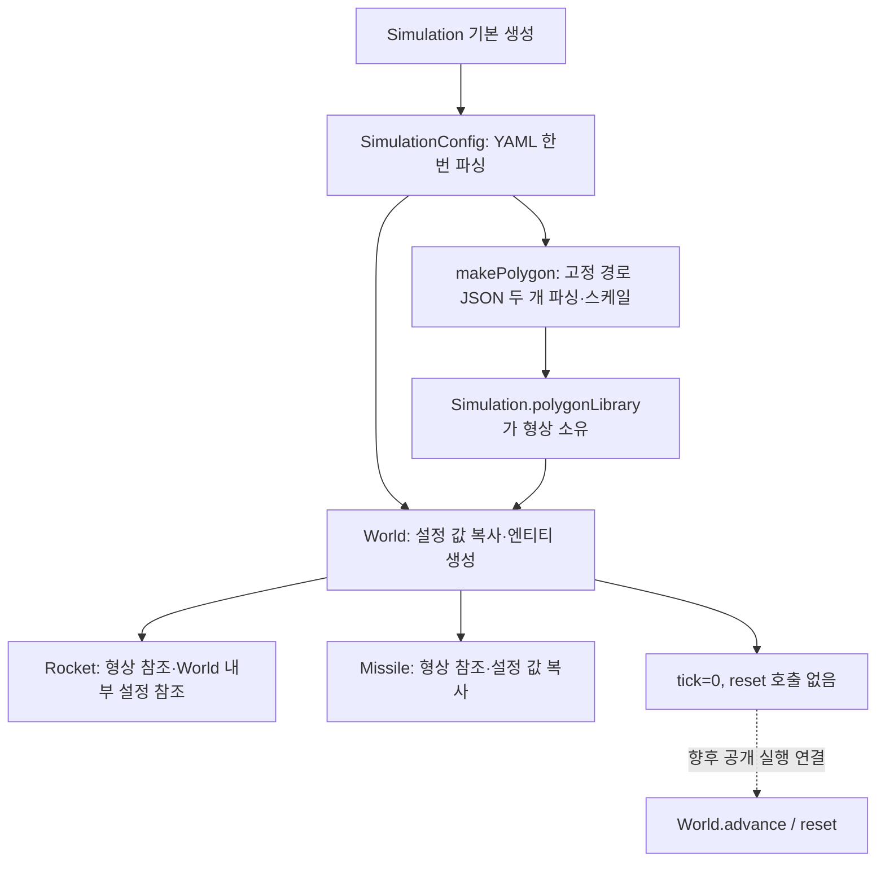
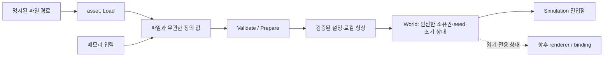

# Simulation 구조·구현·성능 종합 분석

작성일: 2026-09-19  
기준: HEAD `dcf327a`와 분석 시점의 미커밋·미추적 파일을 포함한 작업 트리  
범위: `simulation/`의 25개 파일 전체, 생성에 사용되는 YAML·형상 JSON, 루트 CMake 및 기존 설계 문서

## 1. 분석 전제와 핵심 판단

현재는 아키텍처를 크게 변경하는 중이며, 사용자가 구현 완료 범위로 지정한 것은 **순수 시뮬레이션 구조와 생성 경로**다. 따라서 렌더러 구현, Python 바인딩, 학습 API, `Simulation`의 공개 실행 API 부재를 현재 기능의 결함으로 평가하지 않았다. 이미 존재하는 `World::advance/reset`과 기하 코드는 다음 통합 단계에서 재사용할 코드로 보고 별도 검토했다.

생성 경로는 이전 문서보다 개선되어 있다. YAML은 한 번 읽고, `Simulation`이 형상 저장소를 소유하며, `World`의 선언·정의와 빌드 연결도 맞아 있다. 현재 생성 코드를 직접 컴파일·실행해 기본 생성 성공을 확인했다.

그러나 다음 세 가지는 구조를 확정하기 전에 해결할 가치가 크다.

1. **소유권:** `World`와 `Simulation`의 기본 복사·이동이 형상·설정 참조를 새 소유자에 연결하지 않는다. 생성 직후의 정상 동작과 복사·이동 안전성은 별개다.
2. **생성 경계:** 파일 로더 타입이 코어 API까지 들어가 있고, 유효성 검증 없이 물리 런타임 객체를 만든다. 경로·데이터·실행 상태의 책임이 아직 섞여 있다.
3. **실행 코드 재사용:** 미사일 활성화 누락, 비활성 충돌 검사, 가로·세로 경계 혼용이 실제로 재현됐다. 이 상태에서 처리량만 측정하면 의도한 시뮬레이션의 성능을 평가할 수 없다.

성능상 가장 명확한 반복 비용은 충돌 검사다. 현재 13점·10점 형상에서 **충돌 검사 한 번에 힙 할당 11회**를 관측했다. 다만 단일 로켓·미사일을 120 Hz로 실행할 때 이것만으로 체감 성능 저하가 발생한다고 단정할 수는 없다. 다중 환경이나 최대 속도 실행에서 우선 측정할 지점이다.

## 2. 분석 방법과 한계

- 모든 헤더·구현을 읽고 생성, 소유권, reset, tick, 충돌 경로를 추적했다.
- 현재 소스를 직접 사용하는 일회성 C++ 검증 프로그램을 OS 임시 디렉터리에 작성했다. 프로젝트 소스·설정·기존 문서·빌드 산출물은 수정하지 않았다.
- 동작 검증: MSVC 19.51 계열 도구 경로 `14.51.36231`, `/std:c++latest /MDd /Od`. 현재 6개 구현 파일을 다시 컴파일하고 기존 캐시의 `yaml-cppd.lib` 및 JSON 헤더를 사용했다.
- 성능 검증: 별도 실행 파일에서 `/O2 /MD /DNDEBUG`, 현재 `geometry.cpp`를 다시 컴파일했다. 실제 형상 JSON을 사용하되 파일 읽기는 측정 구간 밖에 두었다.
- CMake 전체 재구성, 새 의존성 다운로드, Python `.pyd` 재빌드, 렌더링 실행, sanitizer 검증은 수행하지 않았다. 따라서 결과는 전체 배포 빌드의 성공이나 무결함을 보증하지 않는다.
- 외부 입력·복사·reset 반례와 작은 충돌 마이크로벤치마크다. 전체 애플리케이션 프로파일이나 변경 전후 회귀 측정은 아니다.

근거 위치의 행 번호는 분석 당시 기준이다. 링크는 파일로 연결하고 본문에 행 범위를 명시했다. 검증용 임시 파일은 보고서의 저장소 산출물에 포함하지 않았다.

### 기존 문서와 달라진 사실

| 이전 설명 | 현재 확인 결과 |
|---|---|
| 생성 때 YAML을 3번 읽음 | `SimulationConfig(path)`에서 1번 읽음 |
| `World` 생성자 선언·정의 불일치 | 현재 두 생성자의 선언·정의가 일치함 |
| `world.cpp`가 빌드 대상에서 빠짐 | 현재 CMake 70행에 포함됨 |
| `simulation.hpp`에 헤더 보호가 없음 | 현재 `#pragma once`가 있음 |
| `FilePath`, `LoadRocket/LoadMissile` 기반 생성 | 현재 `SimulationConfig`와 `PolygonLibrary` 기반 생성 |

[이전 전체 분석](simulation-architecture-review.md)과 [생성 설계안](world-creation-design.md)은 설계 배경으로만 읽었다. 과거의 문제를 현재 결함으로 그대로 옮기지 않았다. `simulation-contract.md`는 현재 제목만 있어 API 계약의 근거로 사용할 수 없었다.

## 3. 현재 아키텍처

### 3.1 생성과 실행의 흐름

근거: [simulation.hpp](../simulation/include/simulation/simulation.hpp) 11–20행, [loader.cpp](../simulation/source/asset/loader.cpp) 20–50행, [world.cpp](../simulation/source/core/world.cpp) 16–39행.

`polygonLibrary`가 `world`보다 먼저 선언되어 먼저 생성되고 나중에 파괴된다. 정상적인 단일 `Simulation` 객체의 수명 안에서는 형상 참조가 유효하다. 또 `World`는 `worldConfig_`를 먼저 복사한 다음 로켓을 그 내부 설정에 연결한다. 위임 생성자의 임시 `SimulationConfig`가 파괴된다는 이유만으로 로켓 설정이 즉시 무효화되는 것은 아니다.

### 3.2 모듈 경계

| 계층 | 현재 책임 | 평가 |
|---|---|---|
| `core/math`, `core/physics` | 벡터, pose, 강체, 형상, 충돌 | 대체로 파일·렌더링을 모르는 작은 계산 단위 |
| `core/entity` | 입력→힘→적분, reset, 미사일 생명주기, 개별 RNG | 책임은 구체적이나 데이터 소유 방식이 서로 다름 |
| `core/world` | 설정·엔티티 보유, tick, 충돌 이벤트 | 파일 로더 계층의 타입을 직접 의존 |
| `asset` | YAML/JSON 파싱, 크기 변환, 물리 객체 구성 | 원시 정의와 런타임 상태가 혼합됨 |
| `simulation` | 파일 기반 생성과 수명 묶기 | 현재는 생성 전용 외피; 공개 실행 API 부재는 예정 작업 |
| `frontend` | 선언·빈 파일 | 현재 구현 범위 밖 |
| CMake | 위 코드를 단일 정적 라이브러리와 생성 실행 파일로 빌드 | headless 코어도 raylib·pybind11 준비에 종속 |

유지할 장점은 고정 `dt`, 작은 구체 타입, GPU 자원이 없는 코어, JSON ADL 변환의 `inline` 처리, YAML 타입 전방 선언이다. 현 규모에 ECS·가상 인터페이스 계층·서비스 구조를 추가해야 할 근거는 없다.

## 4. 생성·아키텍처에서 우선 해결할 문제

우선순위 P1은 소유권 오류·잘못된 물리 상태를 만드는 문제, P2는 구조 확정이나 다음 통합 전에 정할 계약, P3는 국소 정리다. 아래의 실행 결함까지 모두 현재 생성 구현의 미완성으로 취급하지는 않는다.

### A1. 기본 복사·이동이 내부 참조를 원본에 남긴다 — P1, 재현 및 코드 확인

근거: [rocket.hpp](../simulation/include/core/entity/rocket.hpp) 24–31행, [missile.hpp](../simulation/include/core/entity/missile.hpp) 15–25행, [world.cpp](../simulation/source/core/world.cpp) 23–39행, [simulation.hpp](../simulation/include/simulation/simulation.hpp) 11–22행.

`Rocket`은 `polygon_`와 `config_`를 참조로, `Missile`은 `polygon_`만 참조로 갖는다. 이 타입들을 멤버로 가진 `World`와 `Simulation`에는 별도 복사·이동 정책이 없다.

- `World` 복사본의 로켓 설정은 복사본의 `worldConfig_`가 아니라 원본의 `worldConfig_.random.rocket`을 계속 참조한다.
- `Simulation` 복사본은 자체 `PolygonLibrary`를 복사하지만, 그 내부 엔티티는 원본 라이브러리를 계속 참조한다.
- 기본 이동도 참조를 다시 연결하지 않는다. `vector` 버퍼가 이동해도 참조 대상은 원본의 **Polygon 객체 자체**다. 이동 후에는 원본의 이동된 형상을 보거나, 원본 파괴 후 무효 참조가 될 수 있다.
- `World(Rocket, Missile, WorldConfig)`는 전달된 엔티티의 참조를 그대로 복사한다. 새 `WorldConfig`와 로켓이 사용하는 랜덤 설정이 서로 다를 수 있다.
- `World(config, config.makePolygon())`처럼 임시 라이브러리를 전달하면 생성 문장 종료 후 형상 참조가 무효가 된다. API 타입만으로 이 사용을 막지 못한다.

동작 검증에서는 World의 랜덤 각도를 0으로 만든 뒤 복사했다. 검증 코드에서 살아 있는 원본 설정의 각도만 1로 바꾸고 복사본을 `reset(42)`하자, 복사본 설정은 여전히 0인데 실제 로켓 각도는 `0.901429`였다. 원본을 파괴하거나 무효 참조를 역참조하지 않고도 잘못된 참조 연결을 확인한 것이다. `Simulation`은 타입 검사상 복사 생성·이동 생성이 모두 가능했다.

**권장:** 우선 지원할 복사·이동 정책부터 결정한다. 작은 설정은 값으로 소유하고, 형상도 현재 13점·10점 규모라면 값 소유를 기본안으로 검토한다. 여러 World가 형상을 공유할 이유가 측정되면 불변 정의를 수명 보장 핸들로 공유한다. 단순히 복사만 금지하고 기본 이동을 남기거나 `std::move`를 붙이는 것으로 해결되지 않는다. 참조 구조를 유지한다면 소유 객체의 이동까지 금지하는 단기안 또는 모든 내부 참조를 재연결하는 명시적 구현이 필요하다.

### A2. 코어가 파일 로더 타입을 알고 있다 — P2, 구조 확인

근거: [world.hpp](../simulation/include/core/world.hpp) 9·26행, [loader.hpp](../simulation/include/asset/loader.hpp) 27–43행, [loader.cpp](../simulation/source/asset/loader.cpp) 20–48행.

`World`의 공개 생성자가 `asset/loader.hpp`에 정의된 `SimulationConfig`를 받는다. 반대로 그 설정 타입은 코어 엔티티 타입을 포함하고 `Transform`, `RigidBody`, `RocketEngine`까지 만든다. 파일 로딩의 결과가 순수한 정의가 아니라 실행 상태를 일부 포함한 객체다.

그 결과 파일 없는 입력 경로가 일관되지 않다. `SimulationConfig`에는 공개적인 값 기반 생성이 없고, 직접 `Rocket/Missile`을 만들면 A1의 외부 참조 계약을 호출자가 책임져야 한다. 다만 현재 World가 직접 파일을 읽는 것은 아니며, YAML 헤더까지 코어에 전파되는 것도 아니다. 문제는 **타입의 소속과 구성 책임**이다.

**권장:** 파일을 모르는 작은 정의 타입을 코어 경계에 두고, asset 계층이 그 값을 만들어 반환하도록 한다. `World` 생성 시 정의로부터 런타임 pose·강체·RNG를 구성한다. 별도 범용 Builder보다 `Load → Validate/Prepare → Create`의 구체 함수와 값 타입이면 충분하다.

### A3. 파싱 성공과 물리적으로 유효한 입력을 구분하지 않는다 — P1, 재현

근거: [yaml.cpp](../simulation/source/asset/yaml.cpp) 15–79행, [json.hpp](../simulation/include/asset/json.hpp) 13–36행, [shape.hpp](../simulation/include/core/physics/shape.hpp) 20–29행, [rigidbody.hpp](../simulation/include/core/physics/rigidbody.hpp) 41–47행.

현재 검사는 벡터 길이 2와 `fps <= 0` 정도다. 기본 제공 데이터가 유효하더라도 외부 설정이나 새 형상을 받는 생성 API에서는 다음 값을 통과시킨다.

| 입력 | 현재 결과 | 생성 경계에서 필요한 조건 |
|---|---|---|
| YAML `fps: .nan` | 허용, `dt=NaN` | fps·계산된 dt 모두 유한하고 양수 |
| YAML `fps: .inf` | 허용, `dt=0` | 무한대 거부 |
| `mass=0` | 허용, update에서 비유한 속도 | mass·moi가 유한한 양수 |
| 원본 형상 폭 0 | 스케일 후 비유한 좌표 | sourceSize 각 축 양수 |
| size 0·음수, 범위 역전 | 별도 검증 없음 | 양수 크기, min≤max, 시간·속도의 허용 범위 |
| 빈 형상 | 생성 후 충돌 시 예외 | 생성/준비 단계에서 거부 |
| 연속 중복 꼭짓점 | 같은 형상의 자기 충돌도 false 가능 | 0 길이 변·퇴화 형상 거부 |

중복점 검증은 정상 단위 정사각형과 중간 꼭짓점 하나를 연속 중복한 정사각형을 비교했다. 자기 충돌은 각각 `true`, `false`였다. 중복점이 만드는 0 벡터 축에서 모든 투영이 0이고, `maxA <= minB`가 성립하여 분리됐다고 판단하기 때문이다.

현재 제공된 로켓 13점·미사일 10점의 연속 변 외적은 모두 같은 양의 부호였다. 이 관측을 근거로 현재 에셋 자체가 오목해서 잘못됐다고 주장하지 않는다. 외부 형상에 대한 최소 점 개수, 유한성, 중복·퇴화·자기 교차·볼록성 검증이 없다는 것이 문제다.

**권장:** YAML 전용 검증으로 끝내지 말고 메모리 입력도 거치는 공통 준비 경계를 둔다. 단위 변환·스케일 후 결과도 검증한다. 잘못된 형상을 자동 convex hull로 바꾸는 것은 충돌 의미를 바꾸므로 별도 정책 없이 적용하지 않는다.

### A4. 기본 생성이 CWD와 고정 에셋 경로에 묶여 있다 — P2, 구조 확인

근거: [simulation.hpp](../simulation/include/simulation/simulation.hpp) 16–20행, [loader.cpp](../simulation/source/asset/loader.cpp) 14–16·35–48행, [json.hpp](../simulation/include/asset/json.hpp) 31–36행.

공개 `Simulation()`은 항상 상대 경로 `config/simulation-config.yaml`을 읽는다. `SimulationConfig`에 다른 YAML 경로를 주더라도 형상은 항상 `asset/.../polygon.json`에서 읽는다. 실행 파일 위치가 아니라 실행 시 작업 디렉터리가 기준이며, CMake에는 실행 파일 옆으로 설정·형상을 배치하는 규칙이 없다.

이는 저장소 루트에서 생성하는 현재 예제에는 맞지만, build 폴더에서 실행하거나 여러 실험 정의를 사용하기 어렵게 만든다. JSON 로딩은 파일 열기 성공 여부를 먼저 확인하지 않고 파서로 넘겨, 파일 부재와 구문 오류를 구분하는 문맥도 부족하다. `LoadShapeData(path)`가 있는데 `makePolygon()`은 스트림·JSON 파싱을 중복 구현한다.

**권장:** 설정·로켓 형상·미사일 형상 경로를 한 입력으로 받고 한 경계에서 해석한다. 실패 메시지에 파일 경로, 설정 항목, 기대 조건을 남긴다. 현재의 YAML 1회 파싱은 유지한다.

### A5. 객체 구성 완료와 초기 실행 준비 완료가 구분되지 않는다 — P2, 재현·계약 결정

근거: [world.cpp](../simulation/source/core/world.cpp) 16–39·83–95행, [simulation.hpp](../simulation/include/simulation/simulation.hpp) 16–20행, [dummy.cpp](../simulation/source/dummy.cpp) 7–10행.

생성자는 `tick=0`만 설정하고 reset하지 않는다. 제공 설정으로 생성한 직후 로켓 중심은 `(30,30)`, 미사일은 `alive=false`, `needToBeRespawn=false`다. reset 후의 중앙 배치·랜덤 초기 속도·미사일 생성 예약과 다르다.

현재 공개 Simulation API가 생성까지만 구현됐다는 점에서, **reset을 호출하지 않았다는 사실 자체를 기능 누락으로 단정하지 않는다.** 다만 World는 이미 `advance()`를 공개하고 있어 실행 준비의 선행 조건을 정해야 한다. 생성 직후 World를 진행하면 비활성 미사일과 충돌 이벤트가 발생하는 것도 확인했다.

**권장:** 생성 성공이 첫 tick 실행 가능 상태를 의미하도록 공통 초기화 경로를 한 번 호출하거나, 구성된 정의와 실행 중인 World를 명시적으로 구분한다. 첫 방식을 택하면 생성자와 상위 Simulation이 이중 reset하지 않도록 한다. `dummy.cpp`의 생성 성공 출력만으로 초기화·reset 계약을 검증했다고 볼 수는 없다.

## 5. 기존 실행 코드의 재사용 전 확인 사항

이 절은 이미 작성된 tick 코드의 실제 동작을 분석한다. Python·렌더러 같은 미구현 기능과 구분되는 문제다.

### R1. 미사일 생성 완료 시 활성 상태로 전환하지 않는다 — P1, 재현

근거: [missile.cpp](../simulation/source/core/entity/missile.cpp) 43–72·84–95행.

생성 지연이 끝나면 위치·속도·각도만 설정하고 `alive_=true`, `needToBeRespawn_=false`로 전환하지 않는다. 전체 현재 소스에서 alive가 true가 되는 경로가 없다. 이후 tick도 비활성 생성 대기 분기로 들어가며 지연이 만료된 채라면 위치·속도를 계속 다시 추첨한다. 실제로 생성 지연 0인 미사일은 첫 advance 후에도 `alive=false, pending=true`였고, 다음 `advance(dt=0)`에서도 위치가 바뀌었다.

**영향:** 이동하는 미사일이 만들어지지 않고, 생성 계산·난수 생성·삼각함수 계산이 반복될 수 있다. 상태 오류를 먼저 고쳐야 정상 비행 구간의 성능을 잴 수 있다.

**권장:** 비활성/대기/활성 전이와 각 전이에서 초기화할 필드를 명시한다. 불리언 두 개를 유지할지 enum을 쓸지는 작게 결정하되, 생성 완료와 예약 취소를 하나의 전이로 처리한다.

### R2. 비활성 미사일도 충돌·경계 검사에 참여한다 — P1, 재현·코드 확인

근거: [world.cpp](../simulation/source/core/world.cpp) 64–78행, [missile.cpp](../simulation/source/core/entity/missile.cpp) 75–95행.

`World::advance()`는 `missile_.alive()`를 확인하지 않고 SAT와 경계 검사를 호출한다. 생성 직후 원점 부근의 두 형상이 겹쳐 비활성 미사일과의 충돌 이벤트가 발생했다. 미사일 reset은 pose·속도를 지우지 않으므로 이후 reset에서도 이전 위치가 충돌 판정에 남을 수 있다.

또 비활성 미사일의 위치가 경계 밖이면 매 tick `despawn → spawnSchedule`이 실행되어 이미 정한 지연을 다시 추첨한다. 특히 R3 때문에 오른쪽 생성 위치가 즉시 경계 밖으로 판정되는 경로가 있다. 기본 양수 지연에서는 예약 시간이 반복해서 다시 설정되어 생성이 막힐 수 있다.

**권장:** 활성 미사일만 충돌·이탈 검사에 참여하게 하고, 이미 대기 중인 객체의 예약을 매 tick 다시 만들지 않는다. 미사일 reset에서 pose·강체·timer·활성 상태가 어떤 값이어야 하는지도 함께 확정한다.

### R3. 경계 검사에서 world 폭과 높이가 바뀌어 쓰인다 — P1, 재현

근거: [geometry.cpp](../simulation/source/core/physics/geometry.cpp) 31–42행.

`bottom()`의 Y 비교에 `spaceSizeVec.x`를, `left()`의 X 비교에 `spaceSizeVec.y`를 사용한다. 960×540 공간, 60×60 객체에서 다음 결과를 얻었다.

| 객체의 pos | 현재 결과 | 문제 |
|---|---|---|
| `(600,200)` | 경계 밖 | 가로 960인 공간 안인데 X 한계가 높이 540 기준 |
| `(200,600)` | 경계 안 | 실제 높이를 넘었는데 Y 한계가 폭 960 기준 |

추가로 현재 경계는 회전된 형상이 아니라 회전 전 크기와 반 크기 여유를 사용한다. 이 여유와 회전 무시는 게임 규칙일 수 있으므로 결함으로 단정하지 않는다. **축 교차 사용은 명확한 오류**, 경계 접촉·중심 이탈·전체 이탈 중 무엇을 의미할지는 별도 계약이다.

### R4. 중력 설정의 부호와 적용 방식이 충돌한다 — P1 확인 필요, 수치 재현

근거: [config.yaml](../config/simulation-config.yaml) `physics.g`, [config.hpp](../simulation/include/core/physics/config.hpp) 8–10행, [world.cpp](../simulation/source/core/world.cpp) 62행, [transform.hpp](../simulation/include/core/physics/transform.hpp) 22–26·74–76행.

설정은 `g=-9.81`인데 적용 힘은 `-g * mass`다. 입력이 없고 속도가 0인 로켓을 한 tick 진행하면 Y 속도가 `+0.08175`가 된다. `upUnit(0)`과 `top()`은 +Y를 위쪽으로 다루므로, 이 계약을 따르면 중력이 위쪽으로 작용한다.

**권장:** g가 양의 크기인지 부호 있는 Y 가속도인지 정한다. 부호 있는 가속도로 정의하면 `mass * gravityY`를 적용한다. 생성 구조 변경에 물리 부호 변경을 숨기지 말고 별도 동작 변경으로 검증한다. 에셋 JSON의 Y 방향도 메타데이터가 없어 이미지 좌표라고 단정하거나 자동 반전해서는 안 된다.

### R5. reset의 재현 범위와 seed 소유권이 불완전하다 — P2, 일부 재현

근거: [rocket.cpp](../simulation/source/core/entity/rocket.cpp) 59–75행, [missile.cpp](../simulation/source/core/entity/missile.cpp) 75–95행, [world.cpp](../simulation/source/core/world.cpp) 83–95행.

로켓 reset은 pose·강체를 초기화하지만 미사일은 플래그·지연만 초기화한다. 미사일을 생성한 뒤 같은 seed로 reset해도 기존 위치가 그대로이고 속력 `68.3435`가 남는 것을 확인했다. 현재 const 조회 API로도 관찰 가능한 상태다. R2 때문에 외부 관측뿐 아니라 월드 결과에도 영향을 줄 수 있다.

RNG는 엔티티마다 `random_device`로 먼저 초기화되고, 명시 seed reset에서 다시 seed된다. `reset(nullopt)`가 스트림을 이어간다는 로켓 주석은 구현과 일치한다. World가 로켓에 seed, 미사일에 seed+1을 부여하는 것은 현재 두 엔티티에서는 명확하지만, 향후 추가 순서에 따라 스트림 배정이 바뀔 수 있다.

**권장:** 생성 seed, reset(seed), reset(nullopt)의 의미와 조회 가능한 초기 상태를 문서화한다. 명시 seed 생성에서는 불필요한 엔트로피 획득을 피할 수 있도록 seed를 구성 경계에서 전달한다. 서로 다른 표준 라이브러리까지 비트 동일한 난수 결과를 보장한다고 주장하지 않는다.

### R6. 나머지 동작 계약 — P2/P3

| 항목 | 근거와 현재 동작 | 권장 판단 |
|---|---|---|
| `targetPosError` 무시 | YAML에서 읽지만 미사일 생성 방향은 정확한 목표 중심만 사용. `rDist`도 선언만 됨 | 아직 구현 예정인지 명시하거나 실제 적용 |
| 이벤트 우선순위 | world.cpp 67–73행에서 이탈 이벤트 뒤 충돌 이벤트가 덮어씀 | 단일 원인의 명시적 우선순위 또는 복수 사건 표현 |
| 이벤트 이후 진행 | World 내부에 종료 고정 상태 없음 | 순수 World라면 적절할 수 있음. 호출자의 종료 정책과 구분 |
| SAT 접촉 정책 | geometry.cpp 91행은 투영이 닿기만 해도 비충돌 | 접촉을 허용하는 규칙인지 명시 |
| 시간 이산화 | 두 pose 사이의 이동 경로가 아닌 tick 끝 위치로만 충돌 검사 | 기본 미사일 최고 속도는 tick당 약 1.25 단위지만 로켓 최고 속도 제한은 없음. 빠른 경우 터널링 검증 후 substep/연속 검사 판단 |
| 좌표 이름 | `toWolrdPolygon`은 위치·회전 없이 크기만 변환 | 스케일된 로컬 형상이라는 의미를 드러내는 이름·계약 필요 |
| 형상과 size | 준비된 Polygon의 크기와 Transform.size 일치를 API가 보장하지 않음 | 정의 준비 시 함께 검증하고 실행 중 고정할 데이터 결정 |

강체는 속도를 갱신한 다음 위치를 갱신하는 반암시적 Euler 형태이며 force·torque는 매 update 뒤 지운다. 이를 힘 누적 누락이나 잘못된 적분이라고 분류할 근거는 없다.

## 6. 성능 저하 지점

### 6.1 실제 측정한 충돌 비용

근거: [geometry.cpp](../simulation/source/core/physics/geometry.cpp) 11–28·47–94행.

실제 에셋을 60×60으로 스케일했다. 로켓 위치 `(100,100)`, 미사일은 겹치는 위치 `(100,100)` 또는 먼 위치 `(700,350)`다. 시간 측정 중 로켓 각도는 `0..0.099` rad로 반복 변경했다. 각 경우 100,000회씩 5개 표본을 수집했다. 일반 `operator new`를 계수하는 임시 하네스를 사용했고, 할당 계수는 시간 측정 시 껐다.

| 경우 | 단일 호출 힙 할당 | 1회 평균 시간의 중앙값 | 5개 표본 범위 |
|---|---:|---:|---:|
| 겹침 | 11회 | 약 1.118 μs | 1.111–1.149 μs |
| 멀리 떨어짐 | 11회 | 약 0.742 μs | 0.731–0.749 μs |

이 수치는 해당 Windows/MSVC 환경의 작은 벤치마크다. 하네스의 전역 할당 함수, 캐시·CPU 상태 등도 영향을 준다. 다른 플랫폼이나 전체 World 처리량으로 일반화하거나 변경 후 개선율로 해석해서는 안 된다. 확인된 사실은 **분리된 물체도 임시 형상·변 배열을 먼저 만들어 같은 수의 할당을 수행한다**는 점이다.

원인은 다음과 같다.

1. 매 호출마다 월드 좌표 Polygon 두 개를 새로 만들고 각각 reserve한다.
2. `edges`는 reserve 없이 23개 변을 push하여 여러 번 재할당한다.
3. 모든 월드 꼭짓점과 변 배열을 만든 뒤에야 첫 분리 축을 검사한다.
4. 회전 sin/cos와 center 계산이 소스상 꼭짓점 루프 안에 반복된다. 최적화기가 얼마나 제거했는지는 별도 어셈블리 분석을 하지 않았으므로 소스 표현 횟수를 실제 함수 호출 횟수로 단정하지 않는다.

두 형상의 점 수가 n, m이면 최악의 투영 계산은 `(n+m)²`개다. 현재는 최대 23축×23점=529회 dot이며 분리 축을 빨리 찾으면 줄어든다. 이 문제는 현재 물체 두 개 사이의 SAT 비용이고, 현 코드에 다중 물체 O(N²) 전체 쌍 탐색이 구현됐다는 뜻은 아니다.

### 6.2 성능 개선 후보의 우선순위

| 순서 | 후보 | 기대 효과와 조건 |
|---|---|---|
| 1 | 비활성 미사일 SAT 생략, 생명주기 수정 | 잘못된 계산을 제거하고 실제 활성 비율에 맞는 비용 확보 |
| 2 | 반경 등 값싼 broad phase | 멀리 떨어진 경우 월드 Polygon 생성 전 탈락. 회전 시에도 안전한 보수적 경계 필요 |
| 3 | 변 벡터 배열 없이 변을 순회하며 축 투영 | `edges`의 할당·복사 제거. 필요한 축을 즉시 검사 |
| 4 | World 또는 호출자가 소유한 재사용 scratch | 월드 Polygon 2개의 반복 할당 제거. 전역 static 버퍼는 다중 환경·동시 실행과 충돌하므로 피함 |
| 5 | 변환당 sin/cos·center 계산을 명시적으로 1회 수행 | 컴파일러 최적화 의존 감소. 실제 Release 결과로 효과 확인 |
| 6 | 로컬 중심 좌표·법선 캐시 등 추가 전처리 | 준비와 월드 변환의 좌표 계약을 함께 바꿔야 함. 현재 규모에서는 앞 단계 측정 후 판단 |

추가 객체가 많아지기 전에는 공간 트리·SIMD·ECS부터 도입할 필요가 없다. 재사용 버퍼에 `calculatePolygon()`을 그대로 호출하면 `clear()` 없이 push하므로 점이 누적된다. 현재는 매번 빈 벡터를 사용해 발생하지 않지만, 할당 최적화를 할 때 반드시 함께 다뤄야 한다.

### 6.3 생성·reset 비용

근거: [loader.cpp](../simulation/source/asset/loader.cpp) 20–48행, [shape.hpp](../simulation/include/core/physics/shape.hpp) 20–29행, [rocket.hpp](../simulation/include/core/entity/rocket.hpp) 31행, [missile.hpp](../simulation/include/core/entity/missile.hpp) 25행.

- `Simulation`을 N개 생성하면 현재 경로는 YAML N회, JSON 2N회 파싱한다. OS 파일 캐시가 있어도 파싱과 컨테이너 구성은 반복된다. 같은 정의를 재사용하는 메모리 생성 경로가 다중 환경에서 우선 고려할 개선이다.
- `ShapeData::toWolrdPolygon`의 결과 vector에는 reserve가 없다. 점 개수만큼 미리 예약하면 생성 시 재할당을 줄일 수 있다. 다만 현재 13점·10점이고 tick마다 실행되는 함수가 아니므로 우선순위는 낮다.
- 엔티티별 `std::mt19937`는 이번 ABI에서 각각 5,000바이트였다. `sizeof(Rocket)=5,080`, `sizeof(Missile)=5,096`, `sizeof(World)=10,256`이었다. 1,000개 World의 객체 본체만 대략 9.8 MiB이며 형상·할당자 비용은 별도다. 플랫폼별 크기는 다를 수 있다.
- 값으로 엔티티를 받은 `World` 생성자가 멤버에 다시 복사하므로 RNG 상태도 복사한다. const/reference 멤버 때문에 대입 가능성과 생성 가능성도 비대칭이다. 크기보다 먼저 A1의 소유권·복사 의미를 정해야 한다.
- 명시 seed를 줄 예정이어도 현재 엔티티 생성은 `random_device` 호출을 두 번 수행한다. 이 비용은 측정하지 않았으며 병목이라고 확정하지 않는다.
- 로켓의 세 엔진 입력이 모두 활성화되면 `upUnit()`을 세 번 계산한다. 힘 크기를 합산해 방향을 한 번 계산하는 국소 개선 후보지만, 충돌·할당보다 우선이라는 근거는 없다.

생성 시간과 reset 시간은 이번에 정량 측정하지 않았다. 이미 생성된 World의 reset에는 파일 I/O가 없으므로 매 에피소드마다 반드시 파일을 다시 읽는 구조라고 설명해서는 안 된다.

### 6.4 빌드·개발 성능

근거: [CMakeLists.txt](../CMakeLists.txt) 18–59·64–89행.

순수 시뮬레이션 정적 라이브러리인데도 raylib·pybind11을 항상 FetchContent로 준비하고 링크 의존성에 넣는다. 현재 구현 파일은 그 API를 사용하지 않는다. 이 결합은 새 환경 구성·의존성 빌드·배포의 비용과 실패 표면을 늘린다. 다만 링크 선언만 보고 raylib가 매 tick CPU나 GPU 시간을 소모한다고 주장할 수는 없다.

전역 `include_directories`는 루트 빌드에서는 동작하지만 외부 소비자가 `simulation` 타깃을 링크할 때 필요한 include 사용 조건을 타깃 자체로 표현하지 못한다. `target_include_directories`와 코어·로더·선택적 frontend/binding 타깃 분리가 적합하다. 중복 `project`/`cmake_minimum_required`, 오래된 `## python module` 주석은 P3 정리 항목이다.

기존 `build/cmake` 캐시는 Debug였다. 향후 처리량 측정은 Release로 수행해야 한다. 이번 충돌 수치는 기존 Debug 실행 파일이 아니라 따로 최적화 컴파일한 결과다.

## 7. 작은 규모에 맞는 목표 경계

권장 경계는 새로운 거대한 프레임워크가 아니라 다음 계약이다.

| 경계 | 완료 조건 |
|---|---|
| 파일 로딩 | 명시된 입력만 읽고 오류에 파일·필드 문맥을 남김 |
| 준비 | 파일·메모리 입력이 동일 검증을 거침. 스케일된 로컬 형상과 물리 단위가 확정됨 |
| 소유권 | 원본 입력·정의를 파괴해도 World가 안전하거나, 공유 소유 계약이 타입으로 보장됨 |
| 생성 | 초기 실행 상태와 RNG 정책이 명시됨. 생성·reset 초기화가 중복되지 않음 |
| tick | 활성 객체만 계산하고 경계·중력·충돌 사건 의미가 일관됨 |
| 빌드 | 코어는 YAML/JSON·raylib·Python 없이 빌드 가능하고 로더·어댑터가 바깥에서 결합 |

현재 도메인은 로켓 1개·미사일 1개이므로 구체적인 두 엔티티를 유지하는 편이 적합하다. 형상 라이브러리라는 이름 자체가 문제는 아니다. 그 라이브러리가 안전하게 공유할 불변 정의인지, 특정 Simulation만 소유하는 저장 공간인지가 중요하다.

## 8. 수정 순서와 검증 완료 기준

아래는 후속 작업 제안이며 이번 분석에서 소스 수정은 하지 않았다.

| 순서 | 작업 범위 | 확인할 결과 |
|---|---|---|
| 1 | A1: 소유권·복사·이동 정책 | 복사/이동을 지원하면 원본 파괴·컨테이너 재배치 후 reset/조회가 안전. 미지원이면 컴파일 단계에서 금지 |
| 2 | A2–A4: 정의·검증·경로 경계 | 다른 CWD, 다른 설정·형상, 메모리 입력이 같은 정의를 생성. NaN·0 질량·퇴화 형상은 생성 전에 거부 |
| 3 | A5/R5: 생성·reset 계약 | 같은 정의·seed에서 생성 초기 상태와 reset 초기 상태가 합의한 범위에서 동일 |
| 4 | R1–R4: 기존 tick 결함 | 생성 대기→활성→이탈→대기, 비활성 비충돌, 960×540 경계, 무입력 중력 방향을 확인 |
| 5 | 충돌 비용 | 정상 활성/대기 비율로 allocation/tick, Release ticks/s, 충돌별 ns 측정. 동작 동등성을 함께 확인 |
| 6 | 빌드 분리·P3 정리 | headless 코어 독립 빌드와 외부 타깃 소비, 헤더 단독 포함 확인 |

성능 후속 측정은 생성·reset·tick을 섞지 말고 분리한다. 같은 정의의 1/64/1,024 환경, 고정 seed·입력열, 활성/비활성 미사일, 근거리/원거리 형상을 구분하고 프로파일러로 비중을 확인한다. FPS 제한이나 렌더링을 포함한 측정은 코어 처리량과 따로 기록한다.

## 9. 재현 결과 요약

| 검증 | 실제 결과 | 해석 |
|---|---|---|
| 현재 6개 소스 재컴파일·기본 Simulation 생성 | 성공 | 현재 생성 코드가 연결됨. 전체 CMake 검증을 대체하지 않음 |
| Simulation 복사/이동 생성 타입 검사 | 둘 다 true | 안전한 복사/이동이라는 뜻은 아님 |
| World 복사본 reset | 보유 각도 설정 0, 실제 각도 0.901429 | 원본 설정을 계속 참조 |
| 생성 직후 상태 | 로켓 중심 30,30; 미사일 비활성·미예약 | reset 상태와 다름 |
| 생성 직후 첫 tick | 비활성 미사일 충돌, Y 속도 +0.08175 | R2·R4 재현 |
| 직사각형 경계 | 내부 X=600 탈락, 외부 Y=600 통과 | 축 혼용 재현 |
| 지연 0 미사일 생성 | alive=false, pending=true | 활성 전이 누락 |
| 이어서 dt=0 advance | 위치 변경 | 만료된 생성 분기를 재실행 |
| 같은 seed 미사일 reset | 이전 위치·속도 유지 | 완전한 상태 초기화가 아님 |
| NaN/Inf fps | dt=NaN / 0으로 허용 | 유한성 검증 없음 |
| 0 질량, 0 원본 폭 | 비유한 속도 / 좌표 | 잘못된 입력이 런타임 수치로 전파 |
| 중복점 정사각형 자기 충돌 | false; 정상 정사각형은 true | 퇴화 변 검증 필요 |
| 실제 13/10점 충돌 | 근거리·원거리 모두 11회 할당 | 반복 할당 비용 확인 |

고위험 소유권 결과는 검증 중 살아 있는 원본 World의 실제 비-const 설정을 `const_cast`로 바꾸어 관찰했다. 이는 제품 API 사용 제안이 아니라 참조 연결을 확인하기 위한 실험이다. 무효 참조 역참조나 크래시 유도로 결론을 얻지 않았다. 생성 직후 첫 tick 실험에는 로켓 초기 랜덤 범위를 0으로 둔 설정을 사용했으며, 생성자가 reset을 호출하지 않아 생성 pose는 기본 생성과 동일하다.

이번 저장소 산출물은 이 보고서 한 파일이다. 기존 작업 트리의 수정·삭제·미추적 파일은 그대로 유지했다.
