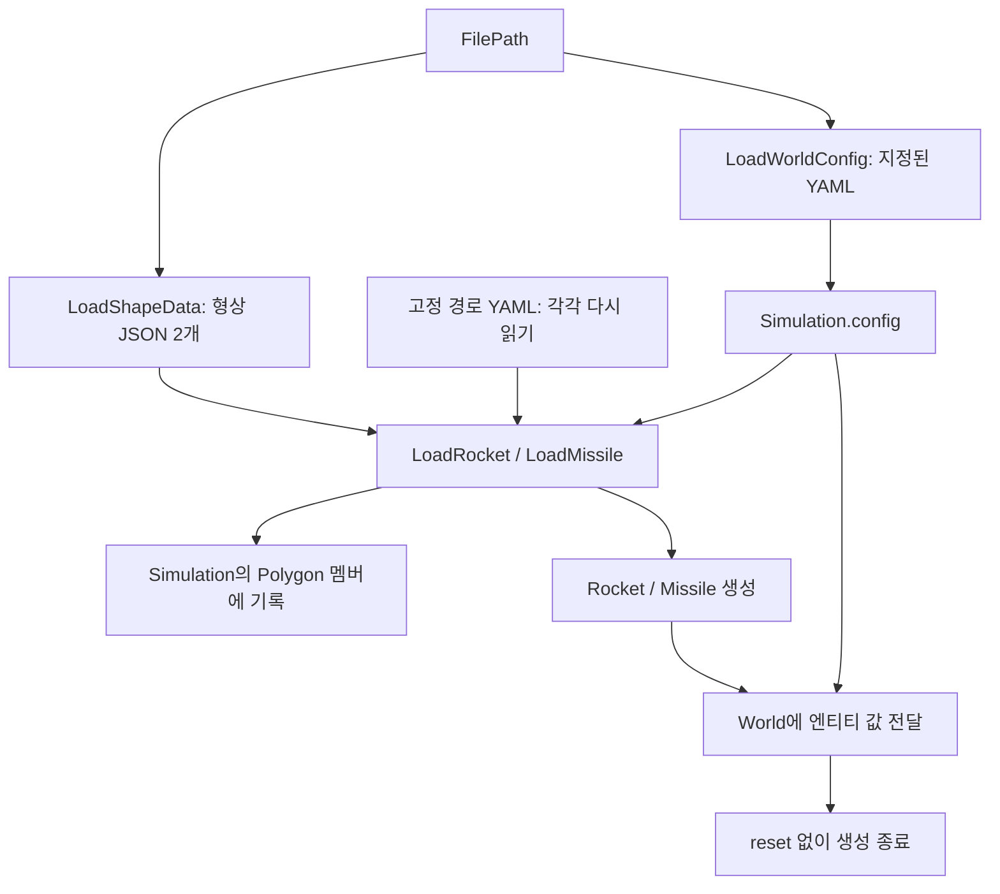
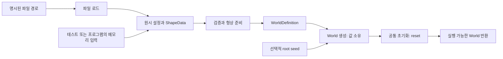

# World 생성 과정 분석 및 재설계안

작성일: 2026-09-16  
기준: HEAD `dcf327a` 및 분석 시작 시 이미 존재하던 미커밋 변경을 포함한 작업 트리  
범위: `Simulation(FilePath)`에서 설정·형상을 읽고 `World`와 엔티티를 생성하여 첫 tick을 실행할 준비가 되기까지

이 문서는 정적 코드 분석과 후속 구현 계획이다. 구현·빌드·실행 테스트는 수행하지 않았다. 기존 작업 트리의 변경은 수정하지 않았다. [기존 전체 아키텍처 분석](simulation-architecture-review.md)은 이전 디렉터리와 API를 설명하므로 현재 코드의 증거로 사용하지 않고, 이번 문서에서 생성 경계를 구체화한다.

## 1. 결론

문제의 중심은 생성자 문법이나 길이가 아니라 **파일에서 얻은 정의, 실행 객체의 소유권, 에피소드 초기화의 경계가 정해지지 않은 것**이다.

현재 `Simulation`은 설정과 형상의 저장소이면서 파일 로딩과 엔티티 조립까지 수행한다. 반면 `World`는 엔티티를 값으로 받아도 그 내부의 형상·설정까지 소유하지 않는다. 엔티티 로더는 전달된 설정 경로를 무시하고 다른 경로에서 설정 일부를 다시 읽는다. 따라서 생성자 호출 하나만 보고 어떤 파일이 사용되는지, 반환된 객체가 얼마나 독립적인지, 바로 실행해도 되는지 판단할 수 없다.

권장안은 다음 세 단계를 분리하는 것이다.

1. **로드:** 명시된 경로에서 YAML 한 번과 형상 JSON 두 개를 읽어 원시 입력 값을 만든다.
2. **준비:** 검증·단위 변환·형상 스케일링을 수행해 파일과 무관한 `WorldDefinition`을 만든다.
3. **생성:** 검증된 정의와 seed로 자기 데이터를 소유하는 `World`를 만들고 공통 reset 절차를 한 번 수행한다.

현재 로켓 1개·미사일 1개에는 **작은 설정과 형상을 값으로 소유하는 방식**을 기본으로 채택한다. 범용 Builder, ShapeLibrary, 공유 포인터 체계는 필수가 아니다. `Simulation`은 완성된 `World`를 감싸는 얇은 진입점으로 남기고 설정·형상을 별도로 보관하지 않는다.

## 2. 현재 생성 경로

주요 근거:

| 파일 | 확인 지점 |
|---|---|
| [`simulation.hpp`](../simulation/include/simulation/simulation.hpp) | 멤버 선언 순서와 `Simulation(const FilePath&)` |
| [`yaml.hpp`](../simulation/include/asset/yaml.hpp) | `LoadWorldConfig`, `LoadRocket`, `LoadMissile` |
| [`json.hpp`](../simulation/include/asset/json.hpp) | `from_json`, `LoadShapeData` |
| [`shape.hpp`](../simulation/include/core/physics/shape.hpp) | `ShapeData::toWolrdPolygon` |
| [`world.hpp`](../simulation/include/core/world.hpp), [`world.cpp`](../simulation/source/core/world.cpp) | 생성자 계약, `reset`, `advance` |
| [`rocket.hpp`](../simulation/include/core/entity/rocket.hpp), [`missile.hpp`](../simulation/include/core/entity/missile.hpp) | 형상·설정 멤버의 참조/값 소유 차이 |
| [`rocket.cpp`](../simulation/source/core/entity/rocket.cpp), [`missile.cpp`](../simulation/source/core/entity/missile.cpp) | 생성 시 상태와 reset 동작 |
| [`simulation-config.yaml`](../config/simulation-config.yaml) | 같은 파일에 있는 월드 설정과 엔티티 정의 |
| [`CMakeLists.txt`](../CMakeLists.txt) | 현재 라이브러리에 포함된 번역 단위 |

멤버는 선언 순서인 `config → rocketPolygon → missilePolygon → world`로 생성된다. 따라서 현재 코드가 초기화되지 않은 Polygon 객체에 쓰는 것은 아니다. 다만 `world(...)`의 로켓·미사일 인수 중 어느 쪽이 먼저 평가되는지에 의존해서는 안 된다. 현재는 별도 컨테이너에 쓰므로 이것 자체를 데이터 경쟁이나 확정적인 오류로 볼 근거는 없다. 순서가 명확한 준비 단계로 옮기면 실패 지점과 실행 순서를 설명하기 쉬워진다.

## 3. 원인과 영향

### 3.1 설정 경로가 전체 생성 입력을 대표하지 못한다

`LoadWorldConfig`는 `FilePath.worldConfig`를 읽지만 `LoadRocket`과 `LoadMissile`은 각각 `config/simulation-config.yaml`을 읽는다. 한 번의 생성에 YAML 로딩이 세 번 발생한다.

예를 들어 별도 실험 설정 파일을 전달해도 중력·랜덤 범위는 실험 파일에서, 크기·질량·엔진은 기본 파일에서 가져온다. 기본 파일을 찾지 못하는 CWD에서는 실험 파일과 형상 경로가 모두 유효해도 생성이 실패할 수 있다. 같은 경로를 사용하더라도 각 읽기 사이 파일이 바뀌면 서로 다른 시점의 설정을 조합할 수 있다.

**근본 원인:** YAML 구조의 `config`와 `entity`를 분리해서 읽는 것과 실행 객체의 책임 분리를 혼동했다. 파일 하나의 입력 스냅샷을 만드는 단계가 없다.

### 3.2 엔티티를 값으로 넘겨도 World가 독립적이지 않다

실제 소유 관계는 다음과 같다.

| 데이터 | 실제 소유자 | 소비 방식 |
|---|---|---|
| 로켓 형상 | `Simulation.rocketPolygon` | `Rocket::polygon_`이 const 참조 |
| 미사일 형상 | `Simulation.missilePolygon` | `Missile::polygon_`이 const 참조 |
| 로켓 랜덤 설정 | `Simulation.config.random.rocket` | `Rocket::config_`가 const 참조 |
| 미사일 랜덤 설정 | `Missile::config_` 자체 | 값 복사 |
| 월드 설정 | `Simulation.config`, `World::worldConfig_` | 별도 값 두 개 |

원본 `Simulation` 하나를 생성·파괴하는 경로에서는 `World`가 먼저 파괴되어 참조 대상의 수명이 유지된다. **현재 생성 직후부터 무조건 dangling이라는 뜻은 아니다.** 문제는 복사·이동 또는 독립적인 World 조립이다.

- `Simulation`을 기본 복사 생성하면 새 Polygon 멤버는 생기지만, 내부 엔티티의 참조는 원본 멤버를 계속 가리킨다. 원본 파괴 후에는 무효 참조가 된다.
- 기본 이동 생성도 참조를 새 멤버로 다시 연결하지 않는다. 참조 대상은 vector의 원소 버퍼가 아니라 원본 Polygon 객체 자체이므로, 버퍼 이동만으로 안전해지지 않는다.
- `World`에 설정을 값으로 전달해도 Rocket의 설정 참조는 `worldConfig_`로 바뀌지 않는다. 다른 호출자가 엔티티와 World에 서로 다른 설정을 전달할 수도 있다.
- 복사 대입은 참조/const 멤버 때문에 제약될 수 있다. 복사 대입 불가와 복사 생성 안전성은 별개다.

**근본 원인:** 참조를 사용해 복사를 줄이는 결정을 먼저 했고, 객체의 이동·복사·독립 실행 계약은 정하지 않았다. 작은 랜덤 설정과 현재 13점·10점 형상에 이 복잡성을 도입할 필요가 확인되지 않았다.

### 3.3 로더가 파싱·변환·외부 변경·런타임 생성을 함께 수행한다

`LoadRocket`과 `LoadMissile`은 파일을 읽고, 물리 객체를 만들고, 형상을 변환하고, `Polygon* container`에 기록한 뒤, 그 Polygon을 참조하는 객체를 반환한다.

반환값만으로 결과가 완결되지 않으며 null 포인터와 참조 수명에 대한 선행 조건도 타입에 드러나지 않는다. 잘못된 파일 입력을 테스트하려 해도 실제 엔티티 구성과 외부 저장소를 준비해야 한다. 이 포인터 출력 인자는 엔티티가 형상을 소유하지 않는 구조를 로더까지 전파한 결과다.

### 3.4 구성 완료와 에피소드 준비 완료가 다르다

현재 Simulation 생성자는 reset을 부르지 않는다. 엔티티 Transform은 위치 `(0,0)`에서 시작하고, 미사일은 `alive=false`, `needToBeRespawn=false`다. `World` 생성자 구현은 tick만 0으로 둔다. 생성 직후는 로켓의 중앙 배치·무작위화 및 미사일 재생성 예약이 적용된 reset 직후와 다르다.

Simulation에는 현재 생성자 외의 공개 실행/reset 인터페이스도 없다. 현행 Python의 `Simulation(timeout, action_period, window_size)` 호출 및 `.pyi`는 새 `Simulation(FilePath)`와 다른 API다. 기존 `.pyd`가 새 생성 경로를 실행한다고 가정할 수 없다.

또한 미사일 reset은 Transform과 RigidBody를 초기화하지 않는다. 생성과 reset을 같은 계약으로 묶으려면 reset 자체도 이전 에피소드의 위치·속도·누적 힘 등을 남기지 않는 완전 초기화가 되어야 한다.

### 3.5 유효한 런타임 입력으로 만드는 단계가 없다

YAML은 두 원소 벡터와 `fps <= 0`를 검사하지만, 유한성·질량·관성·랜덤 범위는 검증하지 않는다. JSON도 필드와 자료형을 읽을 뿐 유효한 충돌 형상인지는 검증하지 않는다.

- `fps=NaN`은 현재 비교를 통과할 수 있고, 무한대 fps는 dt=0을 만든다.
- sourceSize=0이면 형상 스케일링에서 0으로 나눈다.
- mass 또는 moi=0이면 적분에서 0으로 나눈다.
- 빈 형상은 생성에서 거부되지 않고 충돌 검사 때 예외가 발생한다.
- 오목하거나 퇴화한 형상은 현재 SAT가 기대하는 입력에 맞지 않는다.

`toWolrdPolygon`은 이름과 달리 위치·회전을 적용하지 않고 크기만 변환한다. 실제 결과는 엔티티 크기로 스케일된 로컬 형상이다. 이 의미가 불분명하면 이후 충돌 코드에서 이중 변환을 넣기 쉽다.

### 3.6 리팩터링 중간 상태가 검증에서 드러나지 않는다

현재 헤더의 World 생성자는 인수 3개지만 구현은 `const ShapeLibaray*`까지 4개다. 구현의 `shape_`는 현재 헤더에 없고 해당 타입도 현재 소스에서 정의를 찾을 수 없다. 이 상태로 world.cpp를 컴파일하면 선언·정의가 일치하지 않는다.

그런데 CMake의 `simulation` 대상에는 world.cpp가 포함되지 않고, 열거된 번역 단위도 새 Simulation 헤더를 사용하지 않는다. 따라서 기존 라이브러리 빌드가 성공하더라도 새 생성 경로가 연결 가능하다는 증거가 되지 않는다. `simulation.hpp`의 중복 포함 방지도 빠져 있다.

이것들은 즉시 정리할 통합 결함이지만, 생성자 인수와 헤더만 맞추는 것으로 소유권·경로·초기화 문제가 해결되지는 않는다.

## 4. 목표 구조와 데이터 계약

아래 이름은 후속 구현을 위한 개념 이름이며, 이번에 선언이나 클래스를 추가했다는 뜻이 아니다.

| 구성 요소 | 책임과 출력 | 하지 않는 일 |
|---|---|---|
| `SimulationPaths` | 설정·로켓 형상·미사일 형상의 명시적 경로 | 기본 경로를 코어에 숨기기 |
| 파일 로더 | YAML 전체를 한 번 읽은 설정 값, JSON에서 읽은 ShapeData 두 개 | 엔티티 생성, 외부 Polygon에 쓰기 |
| `PrepareWorldDefinition` | 메모리 입력 검증, 단위 변환, 로컬 형상 준비 | 파일 읽기, RNG 소비 |
| `WorldDefinition` | 검증된 월드 설정 및 RocketDefinition·MissileDefinition | 현재 위치·속도·timer·RNG 보유 |
| `World` | 엔티티와 월드 설정 소유, 초기화와 tick 전이 | 경로·YAML·JSON 인지 |
| `Simulation` | 준비된 World를 소유하고 애플리케이션 API로 연결 | 동일 설정·형상의 별도 보관 |

`RocketDefinition`에는 크기, 질량, 관성, 엔진, 랜덤 설정, 준비된 로컬 Polygon을 넣는다. `MissileDefinition`에는 크기, 질량, 관성, 랜덤 설정, 로컬 Polygon을 넣는다. 월드 수준 설정에는 공간 크기·dt·중력만 둔다. 현재 `WorldConfig.random`에 있는 설정은 각 엔티티 정의로 옮겨 실행 시 중복 사본 간 일치 조건을 없앤다.

World를 만들 때 정의의 엔티티 부분을 각 엔티티가 값으로 소유하도록 전달한다. 크기·질량처럼 실행 계산에 필요한 값을 Transform/RigidBody에 옮긴다면 정의 전체를 다시 엔티티 안에 중복 보관하지 않는다. 실행 중 고정 파라미터의 임의 변경은 제공하지 않는다.

### 4.1 소유권과 복사 정책

- 생성된 World는 입력 경로, 임시 ShapeData, 원본 WorldDefinition, Simulation 외부 설정의 수명과 독립적이다.
- 준비된 WorldDefinition은 재사용 가능한 값이다. 여러 환경을 만들 때 파일을 다시 읽지 않고 정의를 복사해 인스턴스화한다. 사용이 끝난 정의는 이동해 소비할 수도 있다.
- World/Simulation은 기본적으로 복사를 금지하고 이동을 지원하는 방향으로 정한다. RNG까지 복제하는 월드 복사는 필요할 때 명시적인 checkpoint/clone 계약으로 추가한다.
- 조회로 반환된 참조의 유효 기간은 소유 World의 수명 및 이동 이전까지다. 외부에서 엔티티를 분리해 보관하는 API는 제공하지 않는다.
- 현재 형상 규모에서 값 복사 비용을 먼저 허용한다. 대규모 환경에서 비용이 측정되면 불변 definition을 공유하고 각 World가 수명을 보장하는 소유 핸들을 갖도록 변경한다. 그때도 raw pointer만 받는 ShapeLibrary로 돌아가지 않는다.

값 소유는 기존 전체 설계 문서의 불변 definition/가변 state 분리와 양립한다. 이번 범위에서는 공유 저장소와 ID 조회까지 만들지 않는 구체적인 선택이다.

### 4.2 호출 경로

필수 API는 파일 기반 진입점과 메모리 기반 진입점 두 개다. 개념적으로 파일 경로는 `Load → Prepare → Create`를 호출하고, 네이티브 테스트나 다른 호출자는 `Prepare → Create`부터 사용한다. 단계마다 가상 인터페이스나 Builder 클래스를 만들 필요는 없으며 작은 값 타입과 구체 함수로 시작한다.

파일 기반 진입점은 `Simulation::FromFiles(paths, seed)` 같은 이름 있는 팩터리로 두고 I/O 발생을 드러내는 것을 권장한다. 실제 World 생성자는 준비된 정의와 seed만 받는다. 기존 `Simulation(FilePath)`를 잠시 유지한다면 같은 경로에 위임하는 호환 진입점이어야 한다.

## 5. 생성 및 초기화 정책

### 5.1 생성 성공은 첫 tick 실행 가능을 의미한다

권장 정책은 **성공적으로 생성된 World는 이미 초기화되어 있다**는 것이다. 외부에서 추가 reset을 해야만 정상인 반제품 상태를 노출하지 않는다. 생성자는 엔티티를 구성한 뒤 reset과 동일한 내부 초기화 절차를 정확히 한 번 호출한다. 팩터리와 Simulation이 중복 reset하지 않는다.

초기화의 사후 조건:

- tick=0.
- 로켓은 기본 중앙 위치에서 설정된 무작위화를 적용하며 속도·각속도도 해당 초기화 규칙을 따른다.
- 미사일은 명시된 기본 위치·각도, 0 속도·각속도·힘·토크로 초기화하고 비활성 상태에서 재생성 대기를 예약한다.
- timer는 이번 초기화에서 뽑은 값이며 이전 에피소드의 상태가 남지 않는다.
- 설정·형상은 이미 검증되었고 첫 충돌 검사에 파일 입력 오류가 뒤늦게 나타나지 않는다.

### 5.2 seed 계약

명시 seed로 생성한 World의 초기 상태는 같은 정의를 가진 World에 그 seed로 reset한 초기 상태와 같아야 한다. 명시 seed가 없으면 생성 경계에서 root seed를 한 번 결정하고 조회/기록 가능하게 한다. `reset(nullopt)`는 기존 RNG 스트림을 이어가며, 무작위화를 끄는 의미로 사용하지 않는다.

현재 reset은 호출 순서에 따라 로켓에 seed, 미사일에 seed+1을 준다. 첫 전환에서는 이를 로켓/미사일의 고정 stream 규칙으로 명시하고 unsigned 범위의 순환까지 정의하면 된다. 나중에 엔티티가 추가되어도 기존 stream이 호출 순서 때문에 달라지지 않게 한다. 더 복잡한 분할 알고리즘은 필요할 때 버전을 올려 도입한다.

명시 seed 사용 시 엔티티별 random_device 호출을 먼저 할 필요는 없다. RNG 초기화 책임을 생성 경계로 모은다. 재현성 보장 범위는 우선 같은 정의·seed·행동열·빌드 환경으로 한정한다. 플랫폼 간 비트 단위 동일성은 별도 과제다.

### 5.3 경로와 오류 계약

상대 경로는 파일 진입점 호출 시의 기준 디렉터리에서 한 번 해석한다. 실행기/패키지 계층이 기본 asset 위치를 결정하고 코어에는 경로를 넘기지 않는다. 로더 내부에서 고정 기본 파일로 대체하거나 CWD를 변경하지 않는다.

파일을 연 뒤 전체 YAML을 한 번 파싱하여 모든 설정을 추출한다. JSON도 형상별 한 번 읽는다. 여러 파일의 동시 갱신까지 원자적 스냅샷으로 보장하는 것은 이번 범위가 아니다. 이후 World 생성 반복·reset·advance에는 파일 I/O가 없어야 한다.

실패는 예외 기반으로 통일하는 것을 권장한다. 오류에는 단계, 파일 경로(메모리 입력이면 입력 이름), 필드 경로, 기대 조건과 실제 값, 가능한 경우 파서 위치를 붙인다. 예: `prepare / entity.rocket.mass / expected finite > 0 / got 0`. 실패하면 World를 반환하지 않으며 외부 Polygon 컨테이너도 변경하지 않는다. 자원 정리는 지역 값의 수명 관리로 처리한다.

## 6. 검증과 좌표 정책

파일 파싱 성공과 도메인 검증 성공을 구분한다. 메모리 기반 호출자도 같은 검증 단계를 통과해야 하며, 임의로 채운 공개 구조체를 곧바로 '검증 완료'로 취급하지 않는다. `WorldDefinition`의 생성 경계를 제한하여 검증된 값만 만들 수 있게 하는 방식을 권장한다.

| 대상 | 생성 전에 보장할 조건 |
|---|---|
| 공간·크기 | 차원은 양수, 지원 수치 범위 내; float 변환 후에도 유한 |
| fps/dt | 유한 양수이며 변환 결과 dt도 유한 양수 |
| 질량·관성 | 유한 양수 |
| 엔진 출력 | 유한한 비음수 크기; 추력/토크 방향은 입력 처리에서 결정 |
| 랜덤 진폭 | 유한 비음수; 위치 비율·속도·각도 진폭의 의미를 명시 |
| 미사일 범위 | 0 ≤ min ≤ max, 속도·지연 모두 유효한 범위 |
| 원본 형상 | sourceSize > 0, 유한 좌표, 서로 다른 꼭짓점 3개 이상, 0 길이 변·퇴화 면적·자기 교차·오목성 거부 |
| 준비된 형상 | 스케일 후에도 유한하고 비퇴화; SAT 입력 조건 유지 |

허용 오차는 지원 좌표 크기를 기준으로 문서화하고 경계 사례로 검증한다. 잘못된 형상을 자동으로 convex hull로 바꾸면 충돌 의미가 달라지므로 기본 동작은 오류로 한다.

현재 충돌 변환은 크기만 변환한 로컬 꼭짓점에 위치·중심 회전을 적용한다. 첫 전환에서는 이 수학을 보존하고 `toWolrdPolygon`을 '스케일된 로컬 형상 준비'라는 의미로 정리한다. 원본 JSON의 Y축 방향은 파일에 메타데이터가 없으므로 이미지 좌표라고 단정해 자동 반전하지 않는다.

기존 문서의 중심 기준 로컬 좌표로 전환하려면 형상 준비와 충돌 변환을 함께 변경하고, 동일 pose의 월드 꼭짓점이 일치하는지 확인해야 한다. 이 좌표 변경은 생성 구조 정리와 별도 단계로 둔다.

중력도 별도 의미 정리가 필요하다. 현재 YAML의 g는 -9.81인데 `World::advance`는 `-g * mass`를 Y 방향 힘으로 적용한다. 권장 최종 계약은 부호 있는 Y 가속도와 `mass * gravityY`의 일관된 사용이다. 다만 생성 경로 개편에 물리 결과 변경을 숨겨 넣지 않고 별도 변경으로 검증한다.

## 7. 구현 순서와 완료 기준

아래는 후속 작업 계획이며 이번 요청에서 실행하지 않았다.

| 순서 | 작업 | 완료 기준 |
|---|---|---|
| 1 | World 선언·정의를 맞추고 실제 생성 경로를 빌드 대상에 연결, 헤더 중복 포함 방지 | 새 API를 포함·생성·링크하는 최소 검증이 통과; dummy 대상 성공으로 대체하지 않음 |
| 2 | 단일 YAML 파싱과 원시 설정 타입 분리, 하드코딩 경로 및 Polygon 출력 인자 제거 | 전달한 파일만 사용; 로딩 결과는 독립적인 값 |
| 3 | 공통 검증과 WorldDefinition 준비 단계 | 파일·메모리 입력이 동일 조건으로 검증되며 런타임 객체 없이 형상 준비 가능 |
| 4 | 엔티티의 형상·설정 값 소유, World 설정 중복 정리 | 원본 입력을 파괴하거나 World를 이동해도 안전; Simulation에 보관용 형상/설정 불필요 |
| 5 | 생성과 reset의 공통 초기화, root seed 정책 적용 | 생성 직후 실행 가능; 생성(seed)와 reset(seed)의 초기 상태 일치 |
| 6 | Simulation 진입점 및 네이티브/Python 호출 경계 연결 | 새 C++ API와 구 Python API의 차이를 명시적으로 처리하고 실제 바인딩을 검증 |

단계 1의 목적은 현재 불일치를 드러내고 정리하는 것이며, 오래된 ShapeLibrary 포인터 설계를 되살리는 것이 아니다. 생성 관련 코드가 YAML/JSON을 포함하는 바깥 계층과 파일을 모르는 코어로 나뉘면, 코어 독립 빌드도 완료 기준에 포함한다.

## 8. 후속 검증 시나리오

| 시나리오 | 기대 결과 |
|---|---|
| 기본 설정과 다른 질량·엔진·중력을 가진 별도 YAML 사용 | 모든 항목이 지정 파일에서 반영되고 기본 경로를 읽지 않음 |
| 다른 CWD에서 절대 경로로 생성 | 동일한 정의와 초기 상태를 생성 |
| 파일에서 준비한 정의와 동일한 메모리 입력 비교 | 준비된 데이터와 seed 기반 초기 상태가 동일 |
| 정의 하나로 여러 World 생성 후 원본 정의·임시 데이터 파괴 | 모든 World가 독립적으로 reset/advance 가능 |
| World 이동 후 원본 파괴, 컨테이너 재배치 | 형상·설정 무효 참조 없이 동작; 가능하면 수명 검사 도구로 확인 |
| 같은 seed로 생성 vs 진행 이력이 있는 World의 reset | tick·pose·속도·timer·활성 상태와 이후 행동열 결과가 동일 |
| 여러 환경을 다른 순서로 실행 | 한 환경의 RNG가 다른 환경 결과에 영향 없음 |
| 누락 파일·문법 오류·누락 필드·NaN/Inf·0 질량·역전 범위·퇴화 형상 | 생성 단계에서 문맥 있는 오류; World 미반환 |
| 로딩 완료 후 파일을 바꾸거나 삭제하고 reset/advance | 기존 World에 영향 없고 추가 파일 읽기 없음 |
| 형상 준비 전후 알려진 크기·위치·회전 비교 | 기존 월드 꼭짓점과 일치; 스케일/회전 중복 없음 |
| 새 API 헤더 반복 포함 및 실제 World 생성 링크 | 헤더 보호·선언/정의·빌드 연결 확인 |

현재 `Missile::advance`의 spawn 분기에는 활성화 플래그 전환이 없고, World 충돌 판정은 비활성 미사일도 검사한다. 경계 함수에는 X/Y 공간 크기를 교차 사용하는 부분도 있다. 이는 생성 구조와 구분되는 실행 결함이다. 첫 tick 통합 검증이나 reset 재현성 검증에서 함께 드러날 수 있으므로 실패를 모두 생성 설계 탓으로 해석하지 말고 별도 수정 항목으로 관리한다.

이번 설계의 완료 여부는 생성자가 짧아졌는지가 아니라, **지정한 입력만으로 생성되고, 생성된 World가 입력 객체의 수명에 의존하지 않으며, 생성 성공 즉시 정의된 초기 상태로 실행 가능한가**로 판단한다.
